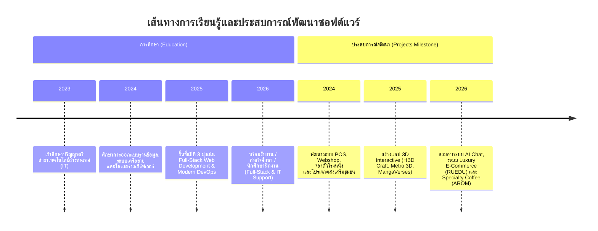

# 📑 ข้อมูลพอร์ตโฟลิโอฉบับสมบูรณ์ (Master Portfolio Data)
## วงศธร ฉาบสีทอง (Wongsathorn Chapseethong) — Full-Stack Developer & IT Support

> เอกสารรวบรวมข้อมูลทั้งหมดของพอร์ตโฟลิโอ ทั้งประวัติส่วนตัว, จุดเด่นทางเทคนิค, ตารางทักษะ, ไทม์ไลน์การศึกษา-ประสบการณ์, และรายละเอียดเชิงลึกของผลงานจริงทั้งหมด **15 โปรเจกต์** พร้อมรายการไฟล์สื่อ (รูปภาพ UI / วิดีโอ) และลิงก์ Source Code / Live Demo

---

## 👤 1. ข้อมูลส่วนตัวและการติดต่อ (Personal Profile & Contact)

| หัวข้อ | รายละเอียด |
| :--- | :--- |
| **ชื่อ-นามสกุล** | นายวงศธร ฉาบสีทอง (Wongsathorn Chapseethong) |
| **ชื่อเล่น** | ดรีม (Dream) |
| **สายงานหลัก** | **Full-Stack Developer** |
| **ความสนใจเสริม** | **IT Support / System Administrator / Network & Infra** |
| **สถานะปัจจุบัน** | นักศึกษาปริญญาตรี ชั้นปีที่ 3 สาขาเทคโนโลยีสารสนเทศ (IT) *(พร้อมรับงาน / รับนักศึกษาฝึกงาน)* |
| **ที่อยู่ / สถานที่พำนัก** | อำเภอหัวหิน จังหวัดประจวบคีรีขันธ์ ประเทศไทย |
| **อีเมล (Email)** | [`pushilkun@gmail.com`](mailto:pushilkun@gmail.com) |
| **เบอร์โทรศัพท์** | [`095-846-2520`](tel:0958462520) |
| **LINE (QR Code / Direct Link)** | [`https://line.me/ti/p/UzaC-aQ75C`](https://line.me/ti/p/UzaC-aQ75C) |
| **GitHub หลัก** | [github.com/GitBababoo](https://github.com/GitBababoo) |
| **GitHub รอง** | [github.com/Gubbitkeytoday](https://github.com/Gubbitkeytoday) |
| **Facebook** | [wongsathorn.ggv](https://web.facebook.com/wongsathorn.ggv) |
| **Live Demos สำคัญ** | - Metro 3D: [metro.itstom.me](https://metro.itstom.me)<br>- HBD 3D Craft: [hbd-3d-craft.pages.dev](https://hbd-3d-craft.pages.dev) |

---

## 💡 2. บทสรุปจุดเด่นและแนวทางการพัฒนา (Professional Summary & Philosophy)

- **Full-Stack Architecture**: พัฒนาเว็บแอปพลิเคชันตั้งแต่โครงสร้างฐานข้อมูล (Database Schema), การวางสถาปัตยกรรม API (REST / SSE Streaming), ตรรกะฝั่งเซิร์ฟเวอร์ ไปจนถึงหน้าบ้าน (Responsive UI & State Management)
- **High Performance & Modern Tech**: เลือกใช้เทคโนโลยีที่ทันสมัยและทรงพลัง เช่น **Next.js (14/16), React 19, TypeScript, Rust + WebAssembly, Python, PostgreSQL** และการจัดการ State ที่มีประสิทธิภาพ
- **Interactive & Real-Time Experience**: มีประสบการณ์สร้างเว็บ 3D ด้วย Three.js, Game Engine 2D Multiplayer, แผนที่จำลองการเดินรถไฟฟ้าระดับเมืองตามพิกัดจริง และระบบประมวลผลเสียง Web Audio API
- **Accessibility & Web Standards**: ออกแบบระบบตามมาตรฐาน WCAG 2.1 AA (0 axe-core violations), รองรับ Progressive Web App (PWA), ทำงานแบบ Offline ด้วย Service Worker และวางโครงสร้าง SEO (JSON-LD Schema)
- **System Administration & IT Support**: มีพื้นฐานแข็งแกร่งด้าน Linux, Docker, Computer Networks, การดูแลรักษาอุปกรณ์ Hardware/Software และการแก้ไขปัญหาเฉพาะหน้าของระบบไอที

---

## 🛠️ 3. ตารางทักษะและความเชี่ยวชาญทางเทคนิค (Technical Skills Matrix)

```
┌─────────────────────────────────────────────────────────────────────────┐
│                           TECH STACK OVERVIEW                           │
├─────────────────┬───────────────────┬─────────────────┬─────────────────┤
│    FRONTEND     │      BACKEND      │    DATABASE     │ DEVOPS & TOOLS  │
├─────────────────┼───────────────────┼─────────────────┼─────────────────┤
│ Next.js 14/16   │ Node.js / Express │ PostgreSQL      │ Docker          │
│ React 19        │ Python (FastAPI)  │ MySQL           │ Git / GitHub    │
│ TypeScript / JS │ PHP / Laravel     │ SQLite          │ GitHub Actions  │
│ Tailwind / UI   │ Rust (Wasm)       │ Firebase        │ Linux / Server  │
│ Three.js / PWA  │ RESTful / SSE     │ Prisma ORM      │ Web Scraping    │
└─────────────────┴───────────────────┴─────────────────┴─────────────────┘
```

### รายละเอียดแยกตามหมวดหมู่:

1. **Frontend Development**:
   - **Frameworks & Libs**: Next.js (App Router 14/16), React 19, Angular, Vite
   - **Languages**: TypeScript, Modern JavaScript (ES6+), HTML5 Semantic, CSS3 / Vanilla CSS
   - **UI & Styling**: Tailwind CSS, shadcn/ui, Glassmorphism, CSS Custom Properties (Variables), Responsive Design
   - **Graphics & Audio**: Three.js (3D Scenes & Animations), Anime.js, MapLibre GL, Web Audio API
   - **Advanced Frontend**: WebAssembly (Wasm via Rust/Worker), Web Workers, Service Worker (Offline PWA), PDF.js, Accessibility (WCAG 2.1 AA)

2. **Backend & Systems**:
   - **Languages**: TypeScript / Node.js, Python 3, PHP, Rust
   - **Frameworks**: Express.js, FastAPI, Laravel
   - **APIs & Protocols**: RESTful APIs, Server-Sent Events (SSE Streaming), WebSockets (Multiplayer Game), JSON-LD Microdata, OpenAI API Integration

3. **Database & Storage**:
   - **Relational Databases**: PostgreSQL, MySQL, SQLite
   - **ORMs & Drivers**: Prisma ORM, Sequelize, PDO
   - **Cloud Database**: Firebase Firestore / Realtime DB, LocalStorage / IndexedDB

4. **DevOps, Tools & Infrastructure**:
   - **Version Control**: Git, GitHub, Git Flow, Branch Protection
   - **CI/CD & Container**: Docker, GitHub Actions Automation
   - **Operating Systems & System Admin**: Linux (Ubuntu/Debian), Windows Administration, Shell Scripting, IT Support & Troubleshooting
   - **Others**: Puppeteer / Cheerio / BeautifulSoup (Web Scraping), Reverse Proxy & Web Hosting

---

## 🎓 4. เส้นทางและการเรียนรู้ (Journey & Experience Timeline)



1. **2023 - ปัจจุบัน (ชั้นปีที่ 3)**:
   - **ระดับปริญญาตรี — สาขาเทคโนโลยีสารสนเทศ (Information Technology: IT)**
   - *สาระการเรียนรู้*: วิศวกรรมซอฟต์แวร์, การวางสถาปัตยกรรมฐานข้อมูลเชิงสัมพันธ์ (Database Normalization & Indexing), เครือข่ายคอมพิวเตอร์และการสื่อสารข้อมูล (Networking), ระบบปฏิบัติการและระบบเสมือน (OS & Virtualization)
2. **2024 - 2026**:
   - **การพัฒนาโปรเจกต์ระบบจริง (Full-Stack & Interactive Systems)**
   - พัฒนาและส่งมอบผลงานรวม 15 โปรเจกต์ มีทั้งระบบเชิงธุรกิจขนาดใหญ่ (Enterprise POS, สแกนใบหน้าพนักงาน, อีคอมเมิร์ซ), ระบบเอไอ (Khui AI Streaming), เว็บจำลอง 3D / แผนที่การเดินทางขนาดใหญ่ (Metro Mini 3D) ตลอดจนงานเขียน Game Engine 2D

---

## 🚀 5. รายละเอียดผลงานทั้งหมด 15 โปรเจกต์ (All 15 Projects Detailed)

---

### 1. Greater Bangkok Metro Mini 3D (ID: 14)
- **หมวดหมู่ (Category)**: `interactive` (อินเตอร์แอคทีฟ)
- **ไอคอน (Icon)**: `fa-solid fa-train-subway`
- **สรุปภาพรวม (Overview)**: เว็บแอปพลิเคชันจำลองโครงข่ายรถไฟฟ้ากรุงเทพฯ และปริมณฑลแบบ 3 มิติ วางแนวรางตามพิกัดจริงจาก OpenStreetMap พร้อมแยกระดับความสูงจริง (ยกระดับ, ระดับดิน, ใต้ดิน)
- **ฟีเจอร์เด่น (Key Features)**:
  - วิ่งขบวนรถตามตารางเวลาจริง GTFS รวม 10 สาย, 193 สถานี, 8,193 เที่ยวต่อวัน
  - ปรับเร่งเวลา / ย้อนเวลาได้ตามใจชอบ
  - ระบบ Train Tracking กล้องติดตามขบวนรถ พร้อมดูตารางจอดทุกสถานีแบบ Real-time
  - ระบบค้นหาสถานีและวางแผนเส้นทางอัจฉริยะ (Journey Planner) บอกจุดเปลี่ยนสายและระยะเวลา
  - รองรับการแสดงผล 9 ภาษา
  - แกนคำนวณตำแหน่งขบวนรถเขียนด้วย **Rust** คอมไพล์เป็น **WebAssembly (Wasm)** รันแยกบน **Web Worker** เพื่อความลื่นไหลระดับ 60 FPS
- **เทคโนโลยี (Tags)**: `React 19`, `TypeScript`, `Three.js`, `MapLibre GL`, `Rust`, `WebAssembly`
- **Source Code**: [github.com/Gubbitkeytoday/tha-metro-mini-3d](https://github.com/Gubbitkeytoday/tha-metro-mini-3d)
- **Live Demo**: [metro.itstom.me](https://metro.itstom.me)
- **รูปหน้าปก (Cover)**: `images/metro3d/01-network-overview.png`
- **ไฟล์ในแกลเลอรี (Gallery Assets)**:
  1. `[Video]` `images/metro3d/demo.mp4`
  2. `[Image]` `images/metro3d/01-network-overview.png`
  3. `[Image]` `images/metro3d/02-trains-street-level.png`
  4. `[Image]` `images/metro3d/03-underground-mrt-blue.png`
  5. `[Image]` `images/metro3d/04-night-lighting.png`
  6. `[Image]` `images/metro3d/05-journey-planner.png`
  7. `[Image]` `images/metro3d/06-train-inspector.png`
  8. `[Image]` `images/metro3d/07-station-board.png`
  9. `[Image]` `images/metro3d/08-guided-tour.png`
  10. `[Image]` `images/metro3d/09-about-support.png`
  11. `[Image]` `images/metro3d/10-phone-map-thai.png`
  12. `[Image]` `images/metro3d/11-phone-search-thai.png`

---

### 2. Khui AI (คุย AI) (ID: 13)
- **หมวดหมู่ (Category)**: `web` (เว็บแอปพลิเคชัน)
- **ไอคอน (Icon)**: `fa-solid fa-robot`
- **สรุปภาพรวม (Overview)**: แพลตฟอร์มสนทนากับตัวละคร AI ภาษาไทยแบบ Full-Stack ครบวงจร พร้อมฟีเจอร์ Social และระบบเศรษฐกิจภายในเกม
- **ฟีเจอร์เด่น (Key Features)**:
  - ระบบสร้างตัวละคร AI (Creator Studio) กำหนดนิสัย บุคลิก และสถานการณ์จำลองได้อิสระ
  - แชทสตรีมมิ่งตอบกลับแบบ Real-time ด้วย Server-Sent Events (SSE) รองรับ Fallback สลับโมเดล AI เมื่อเกิด Error
  - ระบบเศรษฐกิจ: เหรียญสะสม, เช็คอินรายวัน, เควส/ภารกิจ, ส่งของขวัญให้ตัวละคร
  - ระบบชุมชน: คอมเมนต์, จัดอันดับตัวละครยอดนิยม (Leaderboard), รายงานเนื้อหาไม่เหมาะสม 15 หมวด
  - ฟีเจอร์เสริม: ดูดวงรายวัน 12 ราศี และรองรับภาษา i18n รวม 10 ภาษา
- **เทคโนโลยี (Tags)**: `Next.js 14`, `TypeScript`, `Prisma`, `SQLite`, `OpenAI API`, `Tailwind`
- **Source Code**: [github.com/Gubbitkeytoday/khuiai-fullstack](https://github.com/Gubbitkeytoday/khuiai-fullstack)
- **รูปหน้าปก (Cover)**: `images/khuiai/04-discover.png`
- **ไฟล์ในแกลเลอรี (Gallery Assets)**:
  1. `[Video]` `images/khuiai/khuiai-walkthrough.webm`
  2. `[Image]` `images/khuiai/04-discover.png`
  3. `[Image]` `images/khuiai/01-landing-th.png`
  4. `[Image]` `images/khuiai/12-chat-reply.png`
  5. `[Image]` `images/khuiai/05-detail-about.png`
  6. `[Image]` `images/khuiai/07-detail-comments.png`
  7. `[Image]` `images/khuiai/09-report-dialog.png`
  8. `[Image]` `images/khuiai/11-chat-typing.png`
  9. `[Image]` `images/khuiai/14-panel-models.png`
  10. `[Image]` `images/khuiai/15-creator-top.png`
  11. `[Image]` `images/khuiai/18-creator-adult.png`
  12. `[Image]` `images/khuiai/19-shop.png`
  13. `[Image]` `images/khuiai/20-leaderboard.png`
  14. `[Image]` `images/khuiai/21-horoscope.png`
  15. `[Image]` `images/khuiai/22-profile.png`
  16. `[Image]` `images/khuiai/23-preferences.png`
  17. `[Image]` `images/khuiai/24-mobile-discover.png`
  18. `[Image]` `images/khuiai/02-auth-en.png`
  19. `[Image]` `images/khuiai/03-signup-filled.png`
  20. `[Image]` `images/khuiai/06-detail-quests.png`
  21. `[Image]` `images/khuiai/08-comment-posted.png`
  22. `[Image]` `images/khuiai/10-chat-opened.png`
  23. `[Image]` `images/khuiai/13-chat-actions.png`
  24. `[Image]` `images/khuiai/16-creator-filled.png`
  25. `[Image]` `images/khuiai/17-creator-scenario.png`

---

### 3. MangaVerses (ID: 12)
- **หมวดหมู่ (Category)**: `web` (เว็บแอปพลิเคชัน)
- **ไอคอน (Icon)**: `fa-solid fa-book-open`
- **สรุปภาพรวม (Overview)**: เว็บอ่านมังงะและการ์ตูนแปลไทยประสิทธิภาพสูง รองรับทั้งเดสก์ท็อปและสมาร์ทโฟน
- **ฟีเจอร์เด่น (Key Features)**:
  - ระบบค้นหาและจัดหมวดหมู่การ์ตูน, อันดับความนิยมประจำสัปดาห์/เดือน
  - ชั้นหนังสือส่วนตัว (Personal Library / Bookmarks)
  - หน้าอ่านมังงะที่โหลดภาพแบบ Lazy-load รวดเร็ว ปรับโหมดการอ่านได้
  - แผงควบคุมผู้ดูแลระบบหลังบ้าน (Admin Backoffice) จัดการรายชื่อมังงะ เพิ่มตอนใหม่ และจัดการตำแหน่งแสดงโฆษณา
- **เทคโนโลยี (Tags)**: `Next.js 16`, `TypeScript`, `Tailwind`, `shadcn/ui`, `Prisma`, `SQLite`
- **Source Code**: [github.com/Gubbitkeytoday/MangaVerses](https://github.com/Gubbitkeytoday/MangaVerses)
- **รูปหน้าปก (Cover)**: `images/mangaverses/01-home-desktop.png`
- **ไฟล์ในแกลเลอรี (Gallery Assets)**:
  1. `[Image]` `images/mangaverses/01-home-desktop.png`
  2. `[Image]` `images/mangaverses/02-browse-desktop.png`
  3. `[Image]` `images/mangaverses/03-rankings-desktop.png`
  4. `[Image]` `images/mangaverses/04-library-desktop.png`
  5. `[Image]` `images/mangaverses/05-detail-desktop.png`
  6. `[Image]` `images/mangaverses/06-reader-desktop.png`
  7. `[Image]` `images/mangaverses/07-privacy-desktop.png`
  8. `[Image]` `images/mangaverses/08-admin-login-desktop.png`
  9. `[Image]` `images/mangaverses/09-admin-overview-desktop.png`
  10. `[Image]` `images/mangaverses/10-admin-ads-desktop.png`
  11. `[Image]` `images/mangaverses/11-admin-content-desktop.png`
  12. `[Image]` `images/mangaverses/01-home-mobile.png`
  13. `[Image]` `images/mangaverses/06-reader-mobile.png`

---

### 4. SmartPOS Enterprise (ID: 1)
- **หมวดหมู่ (Category)**: `web` (เว็บแอปพลิเคชัน)
- **ไอคอน (Icon)**: `fa-solid fa-cash-register`
- **สรุปภาพรวม (Overview)**: ระบบบริหารจัดการร้านค้าและจุดขายหน้าร้าน (Point of Sale) ระดับองค์กรแบบ All-in-One
- **ฟีเจอร์เด่น (Key Features)**:
  - ระบบคิดเงินหน้าร้าน (POS Terminal) พร้อมตัวเลือกส่วนลด ภาษี และโปรโมชัน
  - ระบบจัดการโต๊ะอาหารและการสั่งออเดอร์ (Table Management)
  - ระบบชำระเงินรองรับเงินสดและ Dynamic QR Code PromptPay
  - ระบบจัดการคลังสินค้า สต็อกคงเหลือ และแจ้งเตือนสินค้าใกล้หมด
  - ระบบสมาชิกสะสมแต้ม, รายงานค่าใช้จ่าย และแดชบอร์ดสถิติยอดขาย
- **เทคโนโลยี (Tags)**: `Next.js`, `TypeScript`, `Tailwind`, `Prisma`, `Postgres`
- **Source Code**: [github.com/GitBababoo/POS](https://github.com/GitBababoo/POS)
- **รูปหน้าปก (Cover)**: `images/pos/02-pos-terminal.png`
- **ไฟล์ในแกลเลอรี (Gallery Assets)**:
  1. `[Image]` `images/pos/02-pos-terminal.png`
  2. `[Image]` `images/pos/01-login.png`
  3. `[Image]` `images/pos/03-products.png`
  4. `[Image]` `images/pos/04-orders.png`
  5. `[Image]` `images/pos/05-dashboard.png`
  6. `[Image]` `images/pos/06-inventory.png`
  7. `[Image]` `images/pos/07-tables.png`
  8. `[Image]` `images/pos/08-customers.png`
  9. `[Image]` `images/pos/09-expenses.png`
  10. `[Image]` `images/pos/10-settings.png`
  11. `[Image]` `images/pos/11-order-detail.png`
  12. `[Image]` `images/pos/12-order-detail-dialog.png`
  13. `[Image]` `images/pos/13-pos-cart-with-items.png`
  14. `[Image]` `images/pos/14-payment-dialog.png`

---

### 5. Enterprise Face Scan Attendance (ID: 2)
- **หมวดหมู่ (Category)**: `web` (เว็บแอปพลิเคชัน)
- **ไอคอน (Icon)**: `fa-solid fa-user-check`
- **สรุปภาพรวม (Overview)**: ระบบเช็คชื่อและบันทึกเวลาเข้า-ออกงานของพนักงานด้วยระบบจดจำใบหน้าอัตโนมัติ บนโครงสร้าง Serverless Cloud
- **ฟีเจอร์เด่น (Key Features)**:
  - หน้าจอ Kiosk สแกนใบหน้าตรวจสอบตัวตนพนักงานแบบ Real-time พร้อมแสดงผลสำเร็จ/ข้อผิดพลาด
  - ระบบลงทะเบียนใบหน้าพนักงานใหม่ (Face Registration)
  - ระบบล็อกอินปลอดภัยด้วย Google Authentication
  - แดชบอร์ดผู้ดูแลระบบ (Admin Directory) ตรวจสอบเวลาเข้างาน, อนุมัติการลา และสรุปเวลาทำงาน
- **เทคโนโลยี (Tags)**: `Angular`, `Firebase`, `Tailwind`, `TypeScript`
- **Source Code**: [github.com/GitBababoo/enterprise-face-scan-attendance](https://github.com/GitBababoo/enterprise-face-scan-attendance)
- **รูปหน้าปก (Cover)**: `images/สแกนหน้า/admin-overview.png`
- **ไฟล์ในแกลเลอรี (Gallery Assets)**:
  1. `[Image]` `images/สแกนหน้า/admin-overview.png`
  2. `[Image]` `images/สแกนหน้า/admin-directory.png`
  3. `[Image]` `images/สแกนหน้า/employee-dashboard.png`
  4. `[Image]` `images/สแกนหน้า/face-registration.png`
  5. `[Image]` `images/สแกนหน้า/google-auth.png`
  6. `[Image]` `images/สแกนหน้า/kiosk-error.png`
  7. `[Image]` `images/สแกนหน้า/kiosk-success.png`
  8. `[Image]` `images/สแกนหน้า/login-screen.png`

---

### 6. HBD 3D Craft (ID: 3)
- **หมวดหมู่ (Category)**: `web` (เว็บแอปพลิเคชัน)
- **ไอคอน (Icon)**: `fa-solid fa-cake-candles`
- **สรุปภาพรวม (Overview)**: เว็บสร้างการ์ดอวยพรวันเกิดแบบ 3 มิติ พร้อมลูกเล่น Interactive เป่าเทียนด้วยไมโครโฟน
- **ฟีเจอร์เด่น (Key Features)**:
  - ปรับแต่งหน้าตาเค้กวันเกิด 3D, จำนวนเทียน และข้อความอวยพร
  - ตรวจจับระดับเสียงลมเป่าผ่านไมโครโฟนด้วย **Web Audio API** เพื่อดับเปลวเทียน 3D
  - เข้ารหัสข้อมูลการ์ดลงใน URL Base64 ทำให้สามารถส่งต่อลิงก์ให้ผู้รับได้ทันทีโดยไม่ต้องพึ่งพาฐานข้อมูล
- **เทคโนโลยี (Tags)**: `Three.js`, `Anime.js`, `Vite`, `Web Audio API`
- **Source Code**: [github.com/GitBababoo/Happy-Birthday](https://github.com/GitBababoo/Happy-Birthday)
- **Live Demo**: [hbd-3d-craft.pages.dev](https://hbd-3d-craft.pages.dev)
- **รูปหน้าปก (Cover)**: `images/HBD/1_creator_dashboard.png`
- **ไฟล์ในแกลเลอรี (Gallery Assets)**:
  1. `[Image]` `images/HBD/1_creator_dashboard.png`
  2. `[Image]` `images/HBD/2_envelope_gate.png`
  3. `[Image]` `images/HBD/3_receiver_cake_view.png`
  4. `[Image]` `images/HBD/4_discover_seo_hub.png`
  5. `[Video]` `images/HBD/bandicam 2026-05-31 16-00-20-719.mp4`

---

### 7. POS Python Offline (ID: 4)
- **หมวดหมู่ (Category)**: `interactive` (อินเตอร์แอคทีฟ / Desktop)
- **ไอคอน (Icon)**: `fa-solid fa-desktop`
- **สรุปภาพรวม (Overview)**: โปรแกรมบริหารจัดการจุดขายหน้าร้านบนระบบปฏิบัติการ Windows ทำงานแบบ Offline 100%
- **ฟีเจอร์เด่น (Key Features)**:
  - ระบบขายหน้าร้าน, จัดการคิว, ออกใบเสร็จ และคำนวณภาษีมูลค่าเพิ่ม
  - ระบบจัดการสิทธิ์พนักงาน (RBAC), บันทึกประวัติการทำงาน (Audit Log)
  - ระบบบริหารจัดการหลายสาขา (Branch Management)
  - ระบบคลังสินค้าและการรายงานยอดขาย บันทึกลงฐานข้อมูล SQLite ฝั่งเครื่อง Client
- **เทคโนโลยี (Tags)**: `Python`, `SQLite`, `Desktop App`, `Tkinter`
- **Source Code**: [github.com/GitBababoo/POS-Python](https://github.com/GitBababoo/POS-Python)
- **รูปหน้าปก (Cover)**: `images/POS python/pos_sales_main.png`
- **ไฟล์ในแกลเลอรี (Gallery Assets)**:
  1. `[Image]` `images/POS python/pos_sales_main.png`
  2. `[Image]` `images/POS python/add_product_modal.png`
  3. `[Image]` `images/POS python/add_staff_modal.png`
  4. `[Image]` `images/POS python/backoffice_approvals.png`
  5. `[Image]` `images/POS python/backoffice_audit_log.png`
  6. `[Image]` `images/POS python/backoffice_branches.png`
  7. `[Image]` `images/POS python/backoffice_customers.png`
  8. `[Image]` `images/POS python/backoffice_dashboard.png`
  9. `[Image]` `images/POS python/backoffice_inventory.png`
  10. `[Image]` `images/POS python/backoffice_login.png`
  11. `[Image]` `images/POS python/backoffice_products.png`
  12. `[Image]` `images/POS python/backoffice_reports.png`
  13. `[Image]` `images/POS python/backoffice_settings.png`
  14. `[Image]` `images/POS python/backoffice_users.png`
  15. `[Image]` `images/POS python/pos_login.png`
  16. `[Image]` `images/POS python/pos_payment_success.png`
  17. `[Image]` `images/POS python/pos_sales_history.png`
  18. `[Image]` `images/POS python/product_categories.png`

---

### 8. Web PDF Editor (ID: 5)
- **หมวดหมู่ (Category)**: `web` (เว็บแอปพลิเคชัน)
- **ไอคอน (Icon)**: `fa-solid fa-file-pdf`
- **สรุปภาพรวม (Overview)**: เว็บแอปพลิเคชันแก้ไขและจัดการเอกสาร PDF บนเบราว์เซอร์โดยตรง
- **ฟีเจอร์เด่น (Key Features)**:
  - เปิดอ่านไฟล์ PDF ขนาดใหญ่ได้อย่างรวดเร็วด้วย **PDF.js**
  - วาดเขียนข้อความ ไฮไลท์ และแนบคำอธิบาย (Annotations)
  - เพิ่มลายเซ็นอิเล็กทรอนิกส์ (E-Signature) พร้อมบันทึกและ Export เป็นไฟล์ใหม่ออกมาได้ทันที
- **เทคโนโลยี (Tags)**: `React`, `TypeScript`, `PDF.js`, `Tailwind`
- **Source Code**: [github.com/GitBababoo/PDF-Editer](https://github.com/GitBababoo/PDF-Editer)
- **รูปหน้าปก (Cover)**: `images/pdf-editer/{693FBFC7-B89F-442F-ABAB-F2018F0BC8E1}.png`
- **ไฟล์ในแกลเลอรี (Gallery Assets)**:
  1. `[Image]` `images/pdf-editer/{693FBFC7-B89F-442F-ABAB-F2018F0BC8E1}.png`
  2. `[Image]` `images/pdf-editer/{29F98BC9-0D28-4752-B3BF-64B1474DD3E2}.png`
  3. `[Image]` `images/pdf-editer/{44A58499-E110-4B44-9711-FFD3E3E2E935}.png`
  4. `[Video]` `images/pdf-editer/bandicam 2026-05-20 12-57-24-871.mp4`

---

### 9. Shopee TH Clone (Webshop) (ID: 7)
- **หมวดหมู่ (Category)**: `web` (เว็บแอปพลิเคชัน)
- **ไอคอน (Icon)**: `fa-solid fa-cart-shopping`
- **สรุปภาพรวม (Overview)**: ระบบร้านค้าออนไลน์และอีคอมเมิร์ซแบบครบวงจร พัฒนาด้วยสถาปัตยกรรม PHP & MySQL
- **ฟีเจอร์เด่น (Key Features)**:
  - หน้ารวมสินค้า, ระบบค้นหา และการกรองตามหมวดหมู่
  - ระบบตะกร้าสินค้า (Shopping Cart) และขั้นตอนการสั่งซื้อ (Checkout Flow)
  - ระบบรายการโปรด (Wishlist) และประวัติคำสั่งซื้อของผู้ใช้งาน
  - แดชบอร์ดแอดมินจัดการสินค้า หมวดหมู่ และสถานะการจัดส่ง
- **เทคโนโลยี (Tags)**: `PHP`, `MySQL`, `JavaScript`
- **Source Code**: [github.com/GitBababoo/webshop](https://github.com/GitBababoo/webshop)
- **รูปหน้าปก (Cover)**: `images/webshop/ws-homepage.png`
- **ไฟล์ในแกลเลอรี (Gallery Assets)**:
  1. `[Image]` `images/webshop/ws-homepage.png`
  2. `[Image]` `images/webshop/ws-admin.png`
  3. `[Image]` `images/webshop/ws-cart.png`
  4. `[Image]` `images/webshop/ws-category.png`
  5. `[Image]` `images/webshop/ws-checkout.png`
  6. `[Image]` `images/webshop/ws-orders.png`
  7. `[Image]` `images/webshop/ws-wishlist.png`

---

### 10. Tank.io (ID: 8)
- **หมวดหมู่ (Category)**: `interactive` (อินเตอร์แอคทีฟ / เกม)
- **ไอคอน (Icon)**: `fa-solid fa-gamepad`
- **สรุปภาพรวม (Overview)**: เกมต่อสู้รถถังออนไลน์แบบ Real-time Multiplayer บนเว็บเบราว์เซอร์
- **ฟีเจอร์เด่น (Key Features)**:
  - พัฒนาโครงสร้าง **Game Engine 2D** ขึ้นมาเองด้วย Canvas API และ TypeScript
  - ระบบสายรถถัง (Class Evolution) และการอัปเกรดความสามารถ
  - ระบบห้องล็อบบี้, การต่อสู้กับบอส (Boss Events) และตารางคะแนนจัดอันดับ
- **เทคโนโลยี (Tags)**: `TypeScript`, `Game Engine`, `Multiplayer`
- **Source Code**: [github.com/GitBababoo/Tank.io](https://github.com/GitBababoo/Tank.io)
- **รูปหน้าปก (Cover)**: `images/tank/gameplay.png`
- **ไฟล์ในแกลเลอรี (Gallery Assets)**:
  1. `[Image]` `images/tank/gameplay.png`
  2. `[Image]` `images/tank/bosses.png`
  3. `[Image]` `images/tank/classes.png`
  4. `[Image]` `images/tank/death.png`
  5. `[Image]` `images/tank/lobby.png`

---

### 11. Nike SNKRS Tracker (ID: 9)
- **หมวดหมู่ (Category)**: `interactive` (อินเตอร์แอคทีฟ / ระบบ Automation)
- **ไอคอน (Icon)**: `fa-solid fa-shoe-prints`
- **สรุปภาพรวม (Overview)**: ระบบ Web Scraping และติดตามสต็อกรองเท้าสนีกเกอร์รุ่นลิมิเต็ดของ Nike SNKRS
- **ฟีเจอร์เด่น (Key Features)**:
  - ติดตามสินค้าเข้าใหม่และสินค้ากำลังจะวางจำหน่าย (Upcoming Releases) แบบเรียลไทม์
  - ระบบแจ้งเตือนเมื่อมีสต็อกเข้ามาในระบบ
  - ฟังก์ชันบอทช่วยเลือกไซส์และอำนวยความสะดวกในการกดซื้อสินค้า
- **เทคโนโลยี (Tags)**: `React`, `Node.js`, `Web Scraping`
- **Source Code**: [github.com/GitBababoo/nike-snkrs-tracker](https://github.com/GitBababoo/nike-snkrs-tracker)
- **รูปหน้าปก (Cover)**: `images/nike/nike-instock.png`
- **ไฟล์ในแกลเลอรี (Gallery Assets)**:
  1. `[Image]` `images/nike/nike-instock.png`
  2. `[Image]` `images/nike/nike-bot.png`
  3. `[Image]` `images/nike/nike-feed.png`
  4. `[Image]` `images/nike/nike-sizepicker.png`
  5. `[Image]` `images/nike/nike-upcoming.png`

---

### 12. Astra Cinema Booking (ID: 10)
- **หมวดหมู่ (Category)**: `web` (เว็บแอปพลิเคชัน)
- **ไอคอน (Icon)**: `fa-solid fa-film`
- **สรุปภาพรวม (Overview)**: ระบบจองตั๋วภาพยนตร์ออนไลน์ระดับ Full-Stack ครอบคลุมตั้งแต่เลือกรอบฉายจนถึงการออกตั๋ว
- **ฟีเจอร์เด่น (Key Features)**:
  - ค้นหารายชื่อภาพยนตร์, ดูรายละเอียด และเลือกรอบฉายตามโรงภาพยนตร์
  - แผนผังเลือกที่นั่งแบบ Interactive และระบบคำนวณราคาสมาชิก
  - ระบบชำระเงินและออกหลักฐานการจอง (Confirmation Ticket)
  - ระบบจัดการข้อมูลภาพยนตร์ รอบฉาย และการจองสำหรับผู้ดูแลระบบ
- **เทคโนโลยี (Tags)**: `React`, `Node.js`, `PostgreSQL`, `Tailwind`
- **Source Code**: [github.com/GitBababoo/cinema-booking](https://github.com/GitBababoo/cinema-booking)
- **รูปหน้าปก (Cover)**: `images/จองตั๋วโรงหนัง/01-home.png`
- **ไฟล์ในแกลเลอรี (Gallery Assets)**:
  1. `[Image]` `images/จองตั๋วโรงหนัง/01-home.png`
  2. `[Image]` `images/จองตั๋วโรงหนัง/02-movies.png`
  3. `[Image]` `images/จองตั๋วโรงหนัง/03-movie-detail.png`
  4. `[Image]` `images/จองตั๋วโรงหนัง/04-cinemas.png`
  5. `[Image]` `images/จองตั๋วโรงหนัง/05-membership.png`
  6. `[Image]` `images/จองตั๋วโรงหนัง/06-booking.png`
  7. `[Image]` `images/จองตั๋วโรงหนัง/07-search.png`
  8. `[Image]` `images/จองตั๋วโรงหนัง/08-support.png`
  9. `[Image]` `images/จองตั๋วโรงหนัง/09-forgot-password.png`
  10. `[Image]` `images/จองตั๋วโรงหนัง/10-reset-password.png`
  11. `[Image]` `images/จองตั๋วโรงหนัง/11-profile.png`
  12. `[Image]` `images/จองตั๋วโรงหนัง/12-orders.png`
  13. `[Image]` `images/จองตั๋วโรงหนัง/13-confirmation.png`
  14. `[Image]` `images/จองตั๋วโรงหนัง/14-manage-booking.png`
  15. `[Image]` `images/จองตั๋วโรงหนัง/15-admin.png`
  16. `[Image]` `images/จองตั๋วโรงหนัง/16-not-found.png`

---

### 13. เว็บไซต์ท่องเที่ยวหาดทรายน้อย (ID: 11)
- **หมวดหมู่ (Category)**: `web` (เว็บแอปพลิเคชัน)
- **ไอคอน (Icon)**: `fa-solid fa-umbrella-beach`
- **สรุปภาพรวม (Overview)**: เว็บไซต์ประชาสัมพันธ์และส่งเสริมการท่องเที่ยวชุมชนหาดทรายน้อย พร้อมฐานข้อมูลธุรกิจท้องถิ่น
- **ฟีเจอร์เด่น (Key Features)**:
  - นำเสนอข้อมูลแหล่งท่องเที่ยว บรรยากาศ และกิจกรรมในพื้นที่
  - ฐานข้อมูลธุรกิจและร้านค้าในชุมชนเพื่อกระตุ้นเศรษฐกิจท้องถิ่น
  - ระบบจัดการเนื้อหา บทความ และข้อมูลติดต่อสำหรับผู้ดูแล
- **เทคโนโลยี (Tags)**: `PHP`, `HTML/CSS`, `MySQL`
- **Source Code**: [github.com/GitBababoo/Beach_2024-5-11](https://github.com/GitBababoo/Beach_2024-5-11)
- **รูปหน้าปก (Cover)**: `images/beach/หน้าหลัก.png`
- **ไฟล์ในแกลเลอรี (Gallery Assets)**:
  1. `[Image]` `images/beach/หน้าหลัก.png`
  2. `[Image]` `images/beach/admin.png`
  3. `[Image]` `images/beach/profile.png`
  4. `[Image]` `images/beach/ข้อมูลหาดทรายน้อย.png`
  5. `[Image]` `images/beach/ติดต่อ.png`
  6. `[Image]` `images/beach/ที่มาโครงการ..png`
  7. `[Image]` `images/beach/ธุรกิจชุมชน.png`
  8. `[Image]` `images/beach/ภาพบรรยากาศโครงการ.png`

---

### 14. ARÓM — Specialty Coffee Roasters (ID: 15)
- **หมวดหมู่ (Category)**: `web` (เว็บแอปพลิเคชัน)
- **ไอคอน (Icon)**: `fa-solid fa-mug-saucer`
- **สรุปภาพรวม (Overview)**: เว็บไซต์แบรนด์กาแฟพิเศษ Specialty Coffee ในกรุงเทพฯ รวม 8 หน้า ทำงานแบบสองภาษา (TH/EN) โดยไม่ต้องใช้ JS ในส่วนหลัก
- **ฟีเจอร์เด่น (Key Features)**:
  - ระบบนาฬิกาจับเวลาชงกาแฟดริป V60 Interactive (Brew Guide & Timer)
  - ตัวกรองเมนูกาแฟและเครื่องดื่ม 36 รายการ
  - คำนวณเวลาเปิด-ปิดร้านตามเวลาจริง (Real-time Opening Hours)
  - โครงสร้าง SEO ขั้นสูงด้วย JSON-LD Schema 11 ประเภท
  - ผ่านเกณฑ์ Accessibility สูงสุด 0 axe-core violations (WCAG 2.1 AA) และรองรับ PWA
- **เทคโนโลยี (Tags)**: `JavaScript`, `HTML/CSS`, `Python`, `PWA`, `Accessibility`
- **Source Code**: [github.com/Gubbitkeytoday/arom-coffee](https://github.com/Gubbitkeytoday/arom-coffee)
- **รูปหน้าปก (Cover)**: `images/arom-coffee/01_home_index/00_full_page.png`
- **ไฟล์ในแกลเลอรี (Gallery Assets)**:
  1. `[Image]` `images/arom-coffee/01_home_index/00_full_page.png`
  2. `[Image]` `images/arom-coffee/01_home_index/02_hero_section.png`
  3. `[Image]` `images/arom-coffee/02_menu/00_full_page.png`
  4. `[Image]` `images/arom-coffee/03_coffee/00_full_page.png`
  5. `[Image]` `images/arom-coffee/03_coffee/06_brew_guide_interactive.png`
  6. `[Image]` `images/arom-coffee/04_story/00_full_page.png`
  7. `[Image]` `images/arom-coffee/05_locations/00_full_page.png`
  8. `[Image]` `images/arom-coffee/06_reserve/00_full_page.png`
  9. `[Image]` `images/arom-coffee/07_journal/00_full_page.png`
  10. `[Image]` `images/arom-coffee/00_responsive_previews/mobile_index_full.png`
  11. `[Image]` `images/arom-coffee/00_responsive_previews/mobile_menu_full.png`
  12. `[Image]` `images/arom-coffee/00_responsive_previews/mobile_coffee_full.png`
  13. `[Image]` `images/arom-coffee/00_responsive_previews/mobile_reserve_full.png`

---

### 15. ฤดู · RUEDU — Flower Atelier (ID: 16)
- **หมวดหมู่ (Category)**: `web` (เว็บแอปพลิเคชัน)
- **ไอคอน (Icon)**: `fa-solid fa-leaf`
- **สรุปภาพรวม (Overview)**: ระบบอีคอมเมิร์ซร้านดอกไม้หรูระดับ Luxury ในกรุงเทพฯ รวม 13 หน้า แบบสองภาษา (TH/EN) พร้อมดีไซน์พรีเมียม
- **ฟีเจอร์เด่น (Key Features)**:
  - ระบบออกแบบจัดช่อดอกไม้ Interactive Bouquet Builder คำนวณราคาเรียลไทม์ตามขนาด ดอกไม้ และการตกแต่ง
  - ตัวกรองสินค้าตามโอกาสและโทนสีที่ Sync เข้ากับ URL Parameters
  - ระบบตะกร้าสินค้าที่บันทึกค่าลง localStorage และขั้นตอนการชำระเงิน 3 สเต็ป
  - Service Worker รองรับการทำงานแบบออฟไลน์ PWA อย่างสมบูรณ์
  - ผ่านเกณฑ์ Accessibility ระดับสากล 0 axe-core violations (WCAG 2.1 AA)
- **เทคโนโลยี (Tags)**: `JavaScript`, `HTML/CSS`, `PWA`, `Service Worker`, `Accessibility`
- **Source Code**: [github.com/Gubbitkeytoday/ruedu-flower-atelier](https://github.com/Gubbitkeytoday/ruedu-flower-atelier)
- **รูปหน้าปก (Cover)**: `images/ruedu/01_homepage/00_full_page.png`
- **ไฟล์ในแกลเลอรี (Gallery Assets)**:
  1. `[Image]` `images/ruedu/01_homepage/00_full_page.png`
  2. `[Image]` `images/ruedu/02_shop/00_full_page.png`
  3. `[Image]` `images/ruedu/03_product_detail/00_full_page.png`
  4. `[Image]` `images/ruedu/04_builder/00_full_page.png`
  5. `[Image]` `images/ruedu/04_builder/03_section_ราคาประกอบขึ้นมาอย่างไร.png`
  6. `[Image]` `images/ruedu/05_subscriptions/00_full_page.png`
  7. `[Image]` `images/ruedu/06_weddings/00_full_page.png`
  8. `[Image]` `images/ruedu/06_weddings/05_แกลเลอรีงานแต่ง.png`
  9. `[Image]` `images/ruedu/07_about/00_full_page.png`
  10. `[Image]` `images/ruedu/08_care/00_full_page.png`
  11. `[Image]` `images/ruedu/08_care/04_calendar_ปฏิทินฤดูดอกไม้ไทย.png`
  12. `[Image]` `images/ruedu/09_journal/00_full_page.png`
  13. `[Image]` `images/ruedu/10_contact/00_full_page.png`
  14. `[Image]` `images/ruedu/11_cart/00_full_page.png`
  15. `[Image]` `images/ruedu/14_mobile_views/mobile_01_index.png`
  16. `[Image]` `images/ruedu/14_mobile_views/mobile_04_builder.png`
  17. `[Image]` `images/ruedu/14_mobile_views/mobile_11_cart.png`

---

## 🎨 6. ฟีเจอร์และการทำงานของระบบ Frontend (Portfolio System Architecture)

1. **Theme Toggle System (สลับโหมดมืด / สว่าง)**:
   - สลับ `data-theme="dark"` และ `data-theme="light"` บนแท็ก `<html>`
   - จดจำค่าผ่าน `localStorage` อัตโนมัติ ปรับชุดสี Glassmorphism และความคมชัดของข้อความ
2. **Search Engine & Filter**:
   - ค้นหาแบบ Dynamic Real-time ได้ทั้งจากชื่อโปรเจกต์, คำอธิบาย หรือชื่อแท็กเทคโนโลยี
   - กรองหมวดหมู่ผลงาน (`ทั้งหมด`, `เว็บแอปพลิเคชัน`, `อินเตอร์แอคทีฟ`) พร้อมแสดงจำนวนผลงานตามจริง
3. **Multi-Media Lightbox Modal**:
   - รองรับทั้งไฟล์ภาพ (**PNG, JPG**) และไฟล์วิดีโอ (**MP4, WebM**) พร้อม Video Player อัตโนมัติ
   - ควบคุมได้ผ่านปุ่มลูกศรหน้าจอ, คีย์บอร์ด (`ArrowLeft` / `ArrowRight` / `Escape`) หรือคลิกที่แถบรูปย่อ (Thumbnails)
   - มีปุ่มขยายสื่อแบบเต็มหน้าจอ (Fullscreen Support)
4. **Interactive UI / UX**:
   - ระบบคัดลอกข้อมูลติดต่อลงคลิปบอร์ดแบบ One-click พร้อมแสดง Toast Notification
   - ปุ่ม Back to Top พร้อม SVG Circular Scroll Progress Ring
   - แอนิเมชันพื้นหลัง Ambient Mesh Blob แบบโมเดิร์น
