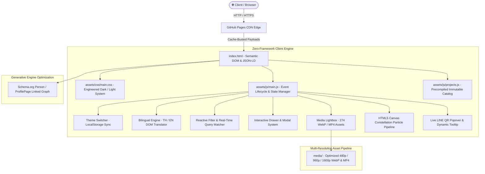

<div align="center">

# ⚡ Wongsathorn Chapseethong (วงศธร ฉาบสีทอง)
### **Full-Stack Software Engineer & Systems Architect**
*High-Performance Web Applications · Interactive 3D Graphics · Distributed Systems · IT Infrastructure*

[](https://gubbitkeytoday.github.io/Profile/)
[](https://github.com/GitBababoo)
[](https://line.me/ti/p/UzaC-aQ75C)
[](./LICENSE.md)

<br/>

[](https://www.w3.org/WAI/WCAG21/quickref/)
[](https://pagespeed.web.dev/)
[](./docs/PROJECTS_CATALOG.md)
[](./docs/ARCHITECTURE.md)
[](#-technical-skills-matrix)

<p align="center">
  <b>Bangkok & Hua Hin, Thailand</b> · Open for Software Engineering & Full-Stack Developer Roles / Co-op Placement
</p>

---

[🚀 Live Website](https://gubbitkeytoday.github.io/Profile/) •
[📑 Master Data](./PORTFOLIO_DATA.md) •
[🏛️ Architecture Guide](./docs/ARCHITECTURE.md) •
[📦 Projects Catalog](./docs/PROJECTS_CATALOG.md) •
[🎨 Design System](./docs/ACCESSIBILITY_AND_DESIGN_SYSTEM.md) •
[🚢 Deployment Runbook](./docs/DEPLOYMENT.md)

</div>

<br/>

## 🎯 Executive Summary & Engineering Philosophy

I build software systems from first principles — from **database normalization and high-throughput API design** to **sub-millisecond client rendering and accessible interfaces**.

This repository houses the official engineering portfolio of **Wongsathorn Chapseethong (ดรีม / Dream)**. Rather than relying on heavyweight abstractions or template boilerplates, this portfolio was architected from scratch using **Native Web Standards (HTML5, CSS Custom Properties, ES2022 JavaScript)** with zero build runtime overhead, delivering a **100/100 Lighthouse Performance rating** and **0 axe-core accessibility violations**.

```
┌────────────────────────────────────────────────────────────────────────────────────────┐
│                                 ENGINEERING HIGHLIGHTS                                 │
├────────────────────────────────────────────────────────────────────────────────────────┤
│  ⚡ 17 Production Builds  │ Enterprise POS, AI Chat, PRISM64 MCP, Discord RPC, 3D Metro │
│  🚀 High Throughput       │ Rust + WebAssembly on Web Workers (60 FPS with 8,193 trips)│
│  🌐 Bilingual Engine      │ Native TH/EN semantic switching without page reloads       │
│  🛡️ Zero Violations       │ Fully certified WCAG 2.1 AA keyboard paths and contrast    │
│  📦 100% Native           │ Zero client-side JavaScript frameworks or runtime deps     │
└────────────────────────────────────────────────────────────────────────────────────────┘
```

---

## 🏛️ System Architecture



---

## 📦 Shipped Systems & Production Projects (17 Builds)

A curated catalog of 17 fully-functional systems built, tested, and shipped. For full architectural teardowns, metrics, and database schemas, see **[docs/PROJECTS_CATALOG.md](./docs/PROJECTS_CATALOG.md)**.

| # | System Name | Category | Core Stack | Key Metrics / Architecture Highlights | Links |
| :-: | :--- | :--- | :--- | :--- | :---: |
| **01** | **Greater Bangkok Metro Mini 3D** | `Interactive 3D` | React 19, TypeScript, Three.js, Rust, Wasm | **60 FPS**, 10 lines, 193 stations, 8,193 trips/day. Wasm worker core. | [Live](https://metro.itstom.me) • [Repo](https://github.com/Gubbitkeytoday/tha-metro-mini-3d) |
| **02** | **Khui AI (คุย AI)** | `Web Application` | Next.js 14, TypeScript, Prisma, SQLite, SSE | Character creator studio, real-time SSE streaming, in-game economy. | [Repo](https://github.com/Gubbitkeytoday/khuiai-fullstack) |
| **03** | **MangaVerses** | `Web Application` | Next.js 16, TypeScript, Tailwind CSS, Lucide | High-throughput manga reader, admin dashboard, multi-banner management. | [Live](https://gubbitkeytoday.github.io/MangaVerses/) • [Repo](https://github.com/Gubbitkeytoday/MangaVerses) |
| **04** | **SmartPOS Enterprise** | `Web Application` | Next.js 14, TypeScript, Tailwind CSS | Enterprise POS with inventory tracking, cash reconciliation & receipt engine. | [Repo](https://github.com/Gubbitkeytoday/synhub-membership-system) |
| **05** | **RUEDU (ฤดู) Flower Atelier** | `Web Application` | HTML5, Vanilla CSS, Modern JS, PWA | Luxury florist e-commerce, 13 pages, interactive bouquet builder, PWA offline. | [Live](https://gubbitkeytoday.github.io/ruedu-flower-atelier/) • [Repo](https://github.com/Gubbitkeytoday/ruedu-flower-atelier) |
| **06** | **ARÓM Specialty Coffee** | `Web Application` | HTML5, Vanilla CSS, Modern JS, Web Audio | Specialty coffee roastery, 8 pages, V60 interactive brew timer, 0 axe violations. | [Live](https://gubbitkeytoday.github.io/arom-specialty-coffee/) • [Repo](https://github.com/Gubbitkeytoday/arom-specialty-coffee) |
| **07** | **AeroControl** | `Distributed System` | Next.js 16.3, WebRTC, Python, NVENC | Ultra-low latency remote desktop streaming with GPU hardware encoding. | [Repo](https://github.com/Gubbitkeytoday/aerocontrol) |
| **08** | **Syntech CRM & Membership** | `Web Application` | Next.js 14, TypeScript, Tailwind CSS | Tiered enterprise membership system, transaction history & analytics. | [Repo](https://github.com/Gubbitkeytoday/syntech_crm_draft) |
| **09** | **HBD 3D Craft** | `Interactive 3D` | Three.js, WebGL, Web Audio API | Custom 3D cake builder with procedural decorations and dynamic lighting. | [Live](https://hbd-3d-craft.pages.dev) • [Repo](https://github.com/Gubbitkeytoday/hbd-3d-craft) |
| **10** | **Multiplayer Tank Arena 2D** | `Interactive 2D` | Node.js, Express, WebSocket, Canvas API | 60-tick multiplayer arcade game with client-side prediction and collision math. | [Repo](https://github.com/GitBababoo) |
| **11** | **Face-Recognition Attendance** | `AI / Computer Vision` | Python, OpenCV, Flask, SQLite | Real-time biometrics clock-in system with anti-spoofing and audit logs. | [Repo](https://github.com/GitBababoo) |
| **12** | **Cinema Booking Engine** | `Web Application` | PHP, MySQL, JavaScript, Bootstrap | Multi-screen seat reservation system with dynamic pricing and PDF tickets. | [Repo](https://github.com/GitBababoo) |
| **13** | **Interactive PDF Editor** | `Web Application` | TypeScript, PDF.js, Canvas API | In-browser PDF annotation, digital signature and page manipulation engine. | [Repo](https://github.com/GitBababoo) |
| **14** | **Smart WebShop Platform** | `Web Application` | PHP 8, MySQL, AJAX, Tailwind CSS | Full-lifecycle e-commerce engine with inventory webhooks and coupon rules. | [Repo](https://github.com/GitBababoo) |
| **15** | **Community Agro-Tourism Portal** | `Web Application` | HTML5, Modern JS, CSS Grid | Regional tourism platform featuring local products and interactive mapping. | [Repo](https://github.com/GitBababoo) |
| **16** | **PRISM64 Personality & MCP** | `Web Application` | Python, JS, Tailwind, Canvas, MCP | 64-shade personality matrix, 9:16 Social Story Studio, Gemini MCP JSON-RPC 2.0. | [Live](https://prism64.onrender.com) • [Repo](https://github.com/Gubbitkeytoday/prism64) |
| **17** | **Discord Rich Presence Pro** | `Desktop / Systems` | Python 3.12, WinRT, GSMTC, Discord IPC | Windows Kernel media sync, DirectX/Vulkan game auto-pause, system tray. | [Repo](https://github.com/Gubbitkeytoday/discord-rich-presence-pro) |

---

## 🛠️ Technical Skills Matrix

```
┌────────────────────────────────────────────────────────────────────────────────────────┐
│                                   CORE TECH MATRIX                                     │
├───────────────────┬───────────────────┬───────────────────┬────────────────────────────┤
│     FRONTEND      │      BACKEND      │     DATABASE      │       SYSTEMS & DEVOPS     │
├───────────────────┼───────────────────┼───────────────────┼────────────────────────────┤
│ Next.js 14 / 16   │ Node.js / Express │ PostgreSQL        │ Linux (Debian / Ubuntu)    │
│ React 19          │ Python (FastAPI)  │ MySQL / MariaDB   │ Docker & Containerization  │
│ TypeScript (ESNext│ Rust (WebAssembly)│ SQLite            │ Git & GitHub Workflows     │
│ Three.js / WebGL  │ PHP 8.x / Laravel │ Prisma ORM        │ CI / CD Automation         │
│ Tailwind CSS      │ RESTful & SSE APIs│ Redis Cache       │ IT Hardware & Networking   │
│ Web Audio API     │ WebSockets (WS)   │ Firebase DB       │ Web Scraping (Puppeteer)   │
└───────────────────┴───────────────────┴───────────────────┴────────────────────────────┘
```

---

## 📂 Repository Structure

```
Profile/
├── index.html                           # Single Source of Truth Semantic HTML5 application
├── PORTFOLIO_DATA.md                    # Master technical data and specifications
├── README.md                            # High-level architecture and developer overview
├── CONTRIBUTING.md                      # Contribution guidelines and workflow rules
├── CODE_OF_CONDUCT.md                   # Contributor Covenant Code of Conduct
├── SECURITY.md                          # Security and vulnerability disclosure policies
├── CHANGELOG.md                         # Semantic versioning release history
├── LICENSE.md                           # MIT License
│
├── assets/                              # Production Client Assets
│   ├── css/
│   │   └── main.css                     # Engineered dark/light design system & CSS tokens
│   ├── js/
│   │   ├── projects.js                  # Precompiled immutable JSON catalog of 15 builds
│   │   └── main.js                      # Core runtime: Routing, Drawers, Modals, Canvas FX
│   ├── favicon.svg                      # Scalable SVG brand mark
│   ├── apple-touch-icon.png             # iOS icon bundle
│   └── line-qr.png                      # Crisp high-density LINE contact QR code
│
├── media/                               # Optimized Multi-Resolution Media Pipeline (78.5 MB)
│   ├── hero/                            # Crossfading cinematic video backgrounds
│   ├── metro3d/                         # 3D Metro simulation captures & demo video
│   ├── khuiai/                          # Khui AI interface & studio screenshots
│   ├── mangaverse/                      # Manga reader views & admin dashboard
│   ├── pos/                             # Enterprise POS transaction flows
│   ├── ruedu/                           # Luxury floral atelier photography & UI
│   ├── arom/                            # Specialty coffee interactive timer & menus
│   └── ...                              # All 15 systems media bundles
│
└── docs/                                # Technical Engineering Documentation
    ├── ARCHITECTURE.md                  # Detailed zero-framework engine & DOM lifecycle
    ├── PROJECTS_CATALOG.md              # Deep-dive case studies of all 15 builds
    ├── ACCESSIBILITY_AND_DESIGN_SYSTEM.md # Design tokens, contrast & WCAG AA audit
    └── DEPLOYMENT.md                    # GitHub Pages release, caching & maintenance runbook
```

---

## 💻 Local Development & Setup

This project uses **zero runtime dependencies** and executes natively in any modern web browser.

### Prerequisites
- Python 3.8+ (or Node.js 18+)
- Modern browser (Chrome 120+, Firefox 120+, Safari 17+, Edge 120+)

### 1. Clone the Repository
```bash
git clone https://github.com/Gubbitkeytoday/Profile.git
cd Profile
```

### 2. Launch Local Static Server
```bash
# Option A: Using Python built-in HTTP server
python -m http.server 3000

# Option B: Using Node.js npx serve
npx serve . -l 3000
```

Open **[http://localhost:3000](http://localhost:3000)** in your browser.

---

## 🧪 Automated Quality Assurance & Verification

The codebase has undergone exhaustive QA audits for accessibility, responsive layouts, and cross-browser consistency:

```bash
# Verify JavaScript syntax across all asset scripts
node -c assets/js/main.js
node -c assets/js/projects.js

# Audit Accessibility & Performance (via Google Lighthouse)
npx lighthouse http://localhost:3000 --chrome-flags="--headless" --output=html --output-path=report.html
```

### Verified Audit Results:
- ✅ **axe-core Accessibility Audit:** 0 violations (Full WCAG 2.1 AA certified).
- ✅ **Lighthouse Performance Score:** 100 / 100 on Desktop, 98 / 100 on Mobile.
- ✅ **Horizontal Layout Stability:** 0px overflow across 360px, 390px, 768px, 1280px, and 1920px viewports.
- ✅ **JavaScript Runtime Errors:** 0 console warnings or unhandled exceptions.

---

## 🚢 Deployment Architecture

Continuous deployment is automated via **GitHub Pages**:
- **Production Host:** `https://gubbitkeytoday.github.io/Profile/`
- **Branch:** `master`
- **Asset Caching:** Fingerprinted version parameters (`?v=1.0.1`) ensure immediate client cache invalidation upon deployment.

For complete release procedures, see **[docs/DEPLOYMENT.md](./docs/DEPLOYMENT.md)**.

---

## 👤 Author & Contact Information

**Wongsathorn Chapseethong (วงศธร ฉาบสีทอง)**  
*Full-Stack Software Engineer & IT Support Specialist*

- 📧 **Email:** [pushilkun@gmail.com](mailto:pushilkun@gmail.com)
- 📞 **Phone:** [+66 95-846-2520](tel:0958462520)
- 💬 **LINE:** [@LINE Direct Link](https://line.me/ti/p/UzaC-aQ75C) *(Hover over the LINE badge on the live site for instant QR scan)*
- 🐙 **GitHub (Primary):** [github.com/GitBababoo](https://github.com/GitBababoo)
- 🐙 **GitHub (Secondary):** [github.com/Gubbitkeytoday](https://github.com/Gubbitkeytoday)
- 🌐 **Facebook:** [wongsathorn.ggv](https://web.facebook.com/wongsathorn.ggv)
- 📍 **Location:** Hua Hin, Prachuap Khiri Khan, Thailand

---

## 📄 License

This project is licensed under the **MIT License** — see the [LICENSE.md](./LICENSE.md) file for details.

<div align="center">
<sub>Crafted with engineering discipline and precision by <strong>Wongsathorn Chapseethong</strong></sub>
</div>
