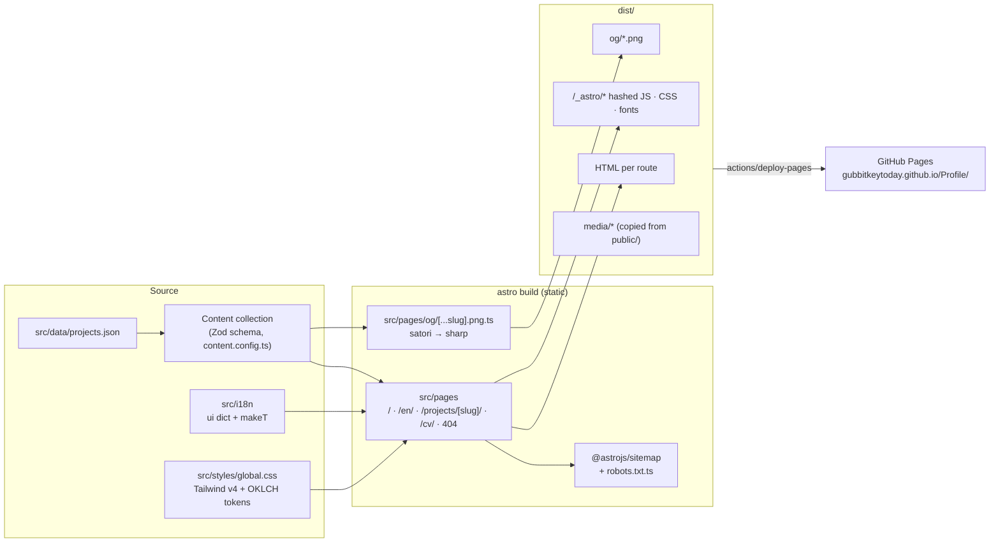

<div align="center">

# Wongsathorn Chapseethong — Portfolio

**Bilingual (TH / EN) engineering portfolio of Wongsathorn Chapseethong (วงศธร ฉาบสีทอง), full-stack developer.**

[](https://github.com/Gubbitkeytoday/Profile/actions/workflows/ci.yml)
[](https://astro.build/)
[](./tsconfig.json)
[](https://tailwindcss.com/)
[](./LICENSE.md)

**Live:** [gubbitkeytoday.github.io/Profile](https://gubbitkeytoday.github.io/Profile/) ·
[English](https://gubbitkeytoday.github.io/Profile/en/) ·
[CV](https://gubbitkeytoday.github.io/Profile/en/cv/)

</div>

---

## Contents

- [Overview](#overview)
- [Highlights](#highlights)
- [Architecture](#architecture)
- [Tech stack](#tech-stack)
- [Project structure](#project-structure)
- [Getting started](#getting-started)
- [Scripts](#scripts)
- [Content editing](#content-editing)
- [Quality gates](#quality-gates)
- [Deployment](#deployment)
- [Featured projects](#featured-projects)
- [สรุปภาษาไทย](#สรุปภาษาไทย)
- [Documentation](#documentation)
- [License](#license)

## Overview

A statically generated portfolio site built with **Astro 7**, **TypeScript** (strictest preset) and **Tailwind CSS v4**.
Every page is pre-rendered HTML; JavaScript is shipped only for the parts that are interactive (navigation drawer,
command palette, project filters, gallery lightbox, copy buttons).

The site has two locales with separate URLs — Thai at `/` (default) and English at `/en/` — a case-study page for every
project (`/projects/<id>/`), a printable CV (`/cv/`), generated Open Graph images, and a sitemap.

All project content lives in one file, [`src/data/projects.json`](./src/data/projects.json), validated at build time by
a Zod schema in [`src/content.config.ts`](./src/content.config.ts).

## Highlights

- **Static first.** Astro renders every route at build time; client scripts only enhance markup that already works.
- **Real i18n routing.** `/` (TH) and `/en/` (EN), with `canonical`, `hreflang` (incl. `x-default`), `og:locale` and a localized sitemap.
- **Per-project pages.** 18 projects × 2 locales = 36 case-study pages, with previous/next navigation and `BreadcrumbList` + `SoftwareSourceCode` JSON-LD.
- **Filterable work index.** Category pills, a tech `<select>` and search, all synced to the URL (`?cat=`, `?tech=`, `?q=`). Skill tiles link straight to `?tech=` filters.
- **Command palette.** Press `⌘K` / `Ctrl K` or `/`. It uses a native `<dialog>` with an ARIA combobox and listbox, and the search ignores punctuation (`nextjs` finds `Next.js`).
- **Printable CV.** `/cv/` and `/en/cv/` render an A4 sheet you can print or save as a PDF.
- **Design tokens in OKLCH.** A dark and a light theme, three motion durations, and Thai typography rules built into the base styles.
- **Motion without a JS library.** Native cross-document view transitions plus CSS scroll-driven animations, all turned off under `prefers-reduced-motion`.
- **Build-time assets.** Iconify SVGs are inlined at build time (only the icons that are used), fonts are self-hosted with Fontsource, and OG images are rendered with satori and sharp.
- **Enforced quality.** Biome, `astro check`, Playwright with axe-core (WCAG 2.2 AA) and Lighthouse CI budgets run on every pull request.

## Architecture


```mermaid
flowchart LR
  subgraph Source
    JSON["src/data/projects.json"] --> CC["Content collection<br/>(Zod schema, content.config.ts)"]
    I18N["src/i18n<br/>ui dict + makeT"]
    CSS["src/styles/global.css<br/>Tailwind v4 + OKLCH tokens"]
  end

  subgraph Build["astro build (static)"]
    CC --> Pages["src/pages<br/>/ · /en/ · /projects/[slug]/ · /cv/ · 404"]
    I18N --> Pages
    CSS --> Pages
    CC --> OG["src/pages/og/[...slug].png.ts<br/>satori → sharp"]
    Pages --> Sitemap["@astrojs/sitemap<br/>+ robots.txt.ts"]
  end

  subgraph Output["dist/"]
    HTML["HTML per route"]
    Assets["/_astro/* hashed JS · CSS · fonts"]
    PNG["og/*.png"]
    Media["media/* (copied from public/)"]
  end

  Pages --> HTML
  Pages --> Assets
  OG --> PNG
  Output -->|actions/deploy-pages| GHP["GitHub Pages<br/>gubbitkeytoday.github.io/Profile/"]
```

See [docs/ARCHITECTURE.md](./docs/ARCHITECTURE.md) for the rendering model, data flow and component map.

## Tech stack

| Area | Choice | Notes |
| :-- | :-- | :-- |
| Framework | [Astro](https://astro.build/) 7 | Static output, `base: '/Profile'`, `trailingSlash: 'always'`, built-in i18n routing |
| Language | TypeScript 6 | `astro/tsconfigs/strictest`, `@/*` → `src/*` path alias |
| Styling | Tailwind CSS 4 (`@tailwindcss/vite`) | Tokens in `src/styles/global.css` (`@theme`, OKLCH) |
| Content | Astro content collections + Zod | `file()` loader over `src/data/projects.json` |
| Icons | Iconify (`@iconify-json/lucide`, `@iconify-json/simple-icons`) | Inlined at build time by `src/components/ui/Icon.astro` |
| Fonts | Fontsource | Inter, Space Grotesk, Anuphan, IBM Plex Sans Thai, JetBrains Mono (self-hosted) |
| Lightbox | PhotoSwipe 5 | Loaded on demand on project pages; images and video |
| OG images | satori + sharp | 1200 × 630 PNG per page type and locale |
| SEO | `@astrojs/sitemap`, `robots.txt` endpoint, web manifest | JSON-LD `Person`, `BreadcrumbList`, `SoftwareSourceCode` |
| Lint / format | Biome 2 | `biome.json` |
| Tests | Playwright + `@axe-core/playwright` | Desktop Chrome and Pixel 7 projects against `astro preview` |
| Performance | Lighthouse CI 0.15 | Budgets in `lighthouserc.cjs` |
| CI / CD | GitHub Actions | `.github/workflows/ci.yml`, `.github/workflows/deploy.yml` |

## Project structure

```text
src/
├── components/
│   ├── hero/          FeaturedTile, TechMarquee
│   ├── layout/        Nav, Footer, CommandPalette
│   ├── profile/       SectionHead, facts.ts (bio, journey, education, CV skill groups)
│   ├── project/       ProjectDetail, Gallery (+ gallery.ts, lightbox.css), MetricGrid,
│   │                  ProjectFacts, PrevNext, SectionHead, dict.ts, media.ts
│   ├── sections/      Hero, Work, Skills, Journey, About, Contact
│   ├── skills/        SkillTile, tech.ts
│   ├── ui/            Icon.astro (build-time Iconify SVG)
│   └── work/          FeaturedTile, Filters, ProjectRow, work.ts (client), meta.ts, shared.ts
├── content.config.ts  Zod schema for the `projects` collection
├── env.d.ts           App.Locals typing (per-page icon sprite)
├── data/
│   └── projects.json  Single source of truth for all project content
├── i18n/index.ts      Locales, href()/asset() helpers, shared UI dict, makeT()
├── layouts/Base.astro <head>: SEO, OG, hreflang, JSON-LD, Thai font preloads, theme bootstrap
├── lib/               icons.ts, media.ts, profile.ts, projects.ts, project-paths.ts
├── pages/
│   ├── index.astro · cv.astro · 404.astro · robots.txt.ts
│   ├── projects/[slug].astro
│   ├── en/            index.astro · cv.astro · projects/[slug].astro
│   └── og/[...slug].png.ts
├── scripts/           nav.ts, palette.ts, search.ts, theme.ts, footer.ts, ui.ts
├── styles/global.css  Tailwind import, fonts, tokens, base layer, view transitions
└── views/             HomePage, ProjectPage, CvPage (shared by TH and EN routes)
```

Other top-level folders: `public/` (media, favicon, manifest, LINE QR), `scripts/sync-media-dimensions.mjs`,
`tests/` (Playwright specs), `docs/`, `.github/workflows/`.

## Getting started

Requirements: **Node.js 22** (see `.nvmrc`; `package.json` requires `>=22.12`) and npm.

```bash
git clone https://github.com/Gubbitkeytoday/Profile.git
cd Profile
npm ci
npm run dev
```

Open <http://localhost:4321/Profile/>. The `/Profile/` base path is required locally too, because it matches GitHub Pages.

To run the end-to-end tests the first time, install Chromium once:

```bash
npm run test:install
```

## Scripts

| Script | Command | Purpose |
| :-- | :-- | :-- |
| `npm run dev` | `astro dev` | Dev server at `http://localhost:4321/Profile/` |
| `npm run build` | `astro build` | Static build into `dist/` (pages, OG images, sitemap) |
| `npm run preview` | `astro preview` | Serve `dist/` under the `/Profile/` base |
| `npm run check` | `astro check` | Type-check `.astro` and `.ts` files |
| `npm run lint` | `biome check .` | Lint and check formatting |
| `npm run format` | `biome check --write .` | Apply safe fixes and formatting |
| `npm test` / `npm run test:e2e` | `playwright test` | Build, preview, then run all Playwright specs |
| `npm run test:ui` | `playwright test --ui` | Playwright UI mode |
| `npm run test:install` | `playwright install --with-deps chromium` | Install the test browser |
| `npm run verify` | lint → check → build → test | Everything CI's `verify` job runs |
| `npm run lhci` | `@lhci/cli@0.15.1 autorun` | Lighthouse CI against `astro preview` (run `npm run build` first) |
| `npm run media:dims` | `node scripts/make-cover-variants.mjs && node scripts/sync-media-dimensions.mjs` | Add 720w cover variants, then write real image width/height back into `projects.json` |

## Content editing

### Add or edit a project

1. Add an object to `src/data/projects.json`. The schema in `src/content.config.ts` rejects anything malformed at build time.

   | Field | Type | Notes |
   | :-- | :-- | :-- |
   | `id` | string | URL slug: `/projects/<id>/`, `og/<id>-<lang>.png` |
   | `order` | positive int | Higher = listed first |
   | `category` | `web` \| `interactive` \| `app` | Filter pill and label |
   | `year` | int 2020–2030 | |
   | `icon` | string | Key into `PROJECT_ICONS` in `src/lib/icons.ts` (falls back to a folder glyph) |
   | `title`, `role`, `summary` | `{ th, en }` | Both locales required, non-empty |
   | `metrics` | `{ value, label: { th, en } }[]` | Shown as metric tiles; audit scores are filtered out of card chips |
   | `features` | `{ th: string[], en: string[] }` | Bullet list on the case-study page |
   | `tags` | string[] | Tech tags; drive the `?tech=` filter, skill counts and tag icons (`TAG_ICONS` in `src/lib/icons.ts`) |
   | `repo`, `live` | URL, optional | Only set `live` for a site that is actually deployed |
   | `cover` | `{ path, widths, width, height }` | Cover image |
   | `gallery` | array | `{ type: "image", path, widths, width, height, format? }` or `{ type: "video", path }` |

2. Add media under `public/media/<folder>/`, using this naming scheme:

   ```text
   <path>-<width>.webp      e.g. media/metro3d/01-network-overview-960.webp
   <path>-<width>.jpg       JPEG variant of the same width
   <path>.mp4               video (gallery type "video")
   <path>-poster.jpg        video poster
   ```

   `path` in the JSON omits the width and extension. `widths` lists the variants that exist (usually `[480, 960, 1600]`).
   A capture taller than WebP's 16383 px limit can ship as JPEG only; set `"format": "jpg"` on that gallery item.

3. Sync the intrinsic sizes and verify:

   ```bash
   npm run media:dims   # fills width/height from the largest variant; exits non-zero if a file is missing
   npm run verify
   ```

Media generation commands (sharp / cwebp) are in [docs/DEPLOYMENT.md](./docs/DEPLOYMENT.md#5-media-optimization).

### Edit copy

- Shared UI strings: `ui` dictionary in `src/i18n/index.ts`.
- Component strings: a co-located `{ th: {...}, en: {...} }` dictionary read through `makeT(dict, lang)`.
- Personal and contact facts: `src/lib/profile.ts`. Biography, journey, education and CV skill groups: `src/components/profile/facts.ts`.

## Quality gates

These are enforced in CI (`.github/workflows/ci.yml`); a pull request that breaks any of them fails.

| Gate | Tool | What must hold |
| :-- | :-- | :-- |
| Lint and format | Biome | `biome check .` passes |
| Types | `astro check` | No type errors (strictest tsconfig) |
| Build | `astro build` | Schema-valid content, every route and OG image renders |
| Accessibility | Playwright + axe-core | **Zero** violations for tags `wcag2a`, `wcag2aa`, `wcag21aa`, `wcag22aa`: home TH and EN in dark and light, plus a project page in both themes, at desktop and mobile sizes |
| Keyboard | Playwright | The skip link is the first tab stop and moves focus to `#main` |
| Health | Playwright | No console errors, failed requests or HTTP ≥ 400; every `` has `width`, `height` and `alt`; internal links on both home pages return 200 |
| SEO | Playwright | `lang`, a single `h1`, canonical, hreflang, `og:image` (1200 × 630), JSON-LD `Person`, sitemap, robots.txt, manifest, noindex 404 |
| Project pages | Playwright | All 36 project URLs return 200 with the right title, canonical and OG image |
| Lighthouse | Lighthouse CI (mobile, 3 runs, median) | Performance ≥ 0.85 · Accessibility = 1.00 · Best practices ≥ 0.95 · SEO = 1.00 · CLS ≤ 0.05 · script ≤ 50 KB · zero third-party requests (errors); LCP ≤ 2.5 s, TBT ≤ 200 ms and total weight ≤ 1.6 MB (warnings) |

Lighthouse checks `/`, `/en/` and `/projects/metro3d/`. Scores change from run to run, so this README does not quote
any; the CI run is the source of truth.

## Deployment

Pushing to `master` runs `.github/workflows/deploy.yml`, which builds the site and publishes `dist/` with
`actions/deploy-pages`.

**One-time setup:** in the repository, open **Settings → Pages → Build and deployment → Source** and choose
**GitHub Actions**. If the source is still "Deploy from a branch", the deploy step fails and Pages keeps serving the old branch build.

Details, the CI pipeline and troubleshooting are in [docs/DEPLOYMENT.md](./docs/DEPLOYMENT.md).

## Featured projects

All **18** projects in `src/data/projects.json`, in site order (highest `order` first). Full details are in
[docs/PROJECTS_CATALOG.md](./docs/PROJECTS_CATALOG.md).

| # | Project | Year | Category | Stack | Links |
| --: | :-- | :-: | :-- | :-- | :-- |
| 01 | **BKK Transit** | 2026 | Web app | Python 3.12, FastAPI, SQLite, Leaflet.js, GTFS, Gemini MCP, Docker | [Case study](https://gubbitkeytoday.github.io/Profile/en/projects/bkk-transit/) · [Repo](https://github.com/Gubbitkeytoday/bkk-transit) |
| 02 | **Discord Rich Presence Pro** | 2026 | Desktop app | Python 3.12, Windows WinRT, GSMTC API, Discord IPC, Pystray, PyInstaller, Systems Architecture | [Case study](https://gubbitkeytoday.github.io/Profile/en/projects/discord-rpc/) · [Repo](https://github.com/Gubbitkeytoday/discord-rich-presence-pro) |
| 03 | **PRISM64** | 2026 | Web app | Python, JavaScript, Tailwind CSS, Canvas API, Leaflet.js, Gemini MCP, Render.com | [Case study](https://gubbitkeytoday.github.io/Profile/en/projects/prism64/) · [Repo](https://github.com/Gubbitkeytoday/prism64) · [Live](https://prism64.onrender.com) |
| 04 | **ฤดู · RUEDU** | 2026 | Web app | JavaScript, HTML/CSS, PWA, Service Worker, Accessibility | [Case study](https://gubbitkeytoday.github.io/Profile/en/projects/ruedu/) · [Repo](https://github.com/Gubbitkeytoday/ruedu-flower-atelier) |
| 05 | **ARÓM** | 2026 | Web app | JavaScript, HTML/CSS, Python, PWA, Accessibility | [Case study](https://gubbitkeytoday.github.io/Profile/en/projects/arom-coffee/) · [Repo](https://github.com/Gubbitkeytoday/arom-specialty-coffee) · [Live](https://gubbitkeytoday.github.io/arom-specialty-coffee/) |
| 06 | **Hat Sai Noi Community Tourism** | 2024 | Web app | PHP, MySQL, HTML/CSS | [Case study](https://gubbitkeytoday.github.io/Profile/en/projects/beach/) · [Repo](https://github.com/GitBababoo/Beach_2024-5-11) |
| 07 | **Astra Cinema Booking** | 2024 | Web app | React, Node.js, PostgreSQL, Tailwind | [Case study](https://gubbitkeytoday.github.io/Profile/en/projects/cinema/) · [Repo](https://github.com/GitBababoo/cinema-booking) |
| 08 | **Nike SNKRS Tracker** | 2024 | Interactive | React, Node.js, Web Scraping | [Case study](https://gubbitkeytoday.github.io/Profile/en/projects/nike/) · [Repo](https://github.com/GitBababoo/nike-snkrs-tracker) |
| 09 | **Tank.io** | 2024 | Interactive | TypeScript, Canvas API, Game Engine, Multiplayer | [Case study](https://gubbitkeytoday.github.io/Profile/en/projects/tank/) · [Repo](https://github.com/GitBababoo/Tank.io) |
| 10 | **Shopee TH Clone (Webshop)** | 2024 | Web app | PHP, MySQL, JavaScript | [Case study](https://gubbitkeytoday.github.io/Profile/en/projects/webshop/) · [Repo](https://github.com/GitBababoo/webshop) |
| 11 | **Web PDF Editor** | 2025 | Web app | React, TypeScript, PDF.js, Tailwind | [Case study](https://gubbitkeytoday.github.io/Profile/en/projects/pdf-editer/) · [Repo](https://github.com/GitBababoo/PDF-Editer) |
| 12 | **POS Python Offline** | 2024 | Desktop app | Python, SQLite, Tkinter, Desktop App | [Case study](https://gubbitkeytoday.github.io/Profile/en/projects/pos-python/) · [Repo](https://github.com/GitBababoo/POS-Python) |
| 13 | **HBD 3D Craft** | 2025 | Interactive | Three.js, Anime.js, Vite, Web Audio API | [Case study](https://gubbitkeytoday.github.io/Profile/en/projects/hbd/) · [Repo](https://github.com/GitBababoo/Happy-Birthday) · [Live](https://hbd-3d-craft.pages.dev) |
| 14 | **Enterprise Face Scan Attendance** | 2024 | Web app | Angular, Firebase, Tailwind, TypeScript | [Case study](https://gubbitkeytoday.github.io/Profile/en/projects/facescan/) · [Repo](https://github.com/GitBababoo/enterprise-face-scan-attendance) |
| 15 | **SmartPOS Enterprise** | 2024 | Web app | Next.js, TypeScript, Tailwind, Prisma, PostgreSQL | [Case study](https://gubbitkeytoday.github.io/Profile/en/projects/pos/) · [Repo](https://github.com/GitBababoo/POS) |
| 16 | **MangaVerses** | 2025 | Web app | Next.js 16, TypeScript, Tailwind, shadcn/ui, Prisma, SQLite | [Case study](https://gubbitkeytoday.github.io/Profile/en/projects/mangaverses/) · [Repo](https://github.com/Gubbitkeytoday/MangaVerses) |
| 17 | **Khui AI** | 2026 | Web app | Next.js 14, TypeScript, Prisma, SQLite, OpenAI API, Tailwind | [Case study](https://gubbitkeytoday.github.io/Profile/en/projects/khuiai/) · [Repo](https://github.com/Gubbitkeytoday/khuiai-fullstack) |
| 18 | **Greater Bangkok Metro Mini 3D** | 2025 | Interactive | React 19, TypeScript, Three.js, MapLibre GL, Rust, WebAssembly | [Case study](https://gubbitkeytoday.github.io/Profile/en/projects/metro3d/) · [Repo](https://github.com/Gubbitkeytoday/tha-metro-mini-3d) · [Live](https://metro.itstom.me) |

By category: 12 web apps, 4 interactive, 2 desktop apps. All 18 link to a repository; 4 link to a live deployment.

## สรุปภาษาไทย

พอร์ตโฟลิโอสองภาษา (ไทย/อังกฤษ) ของ **วงศธร ฉาบสีทอง (ดรีม)** นักพัฒนา Full-Stack จากหัวหิน
สร้างด้วย **Astro 7 + TypeScript + Tailwind CSS v4** และ build เป็น HTML แบบ static ทั้งหมด ส่ง JavaScript เฉพาะส่วนที่ต้องโต้ตอบ

- **URL แยกตามภาษา:** ภาษาไทยอยู่ที่ `/` ภาษาอังกฤษอยู่ที่ `/en/` แต่ละโปรเจกต์มีหน้าของตัวเองที่ `/projects/<id>/` และมีหน้า CV สำหรับพิมพ์ที่ `/cv/`
- **ข้อมูลผลงาน:** ทั้ง 18 โปรเจกต์อยู่ในไฟล์เดียวคือ `src/data/projects.json` ระบบตรวจ schema ตอน build
- **เพิ่มโปรเจกต์:** เพิ่ม object ใน JSON แล้ววางภาพไว้ที่ `public/media/` ตั้งชื่อไฟล์แบบ `<path>-<width>.webp|jpg` จากนั้นรัน `npm run media:dims` และ `npm run verify`
- **เริ่มพัฒนา:** ใช้ Node 22 รัน `npm ci` แล้ว `npm run dev` จากนั้นเปิด <http://localhost:4321/Profile/>
- **มาตรฐานที่ CI บังคับ:** axe-core (WCAG 2.2 AA) ต้องเจอ 0 violations และต้องผ่านเกณฑ์ Lighthouse CI ตามที่ตั้งไว้ใน `lighthouserc.cjs`
- **Deploy:** push ขึ้น `master` แล้วเว็บจะ deploy อัตโนมัติ แต่ต้องตั้งค่าครั้งแรกก่อนที่ Settings → Pages → Source → **GitHub Actions**

## Documentation

| Document | Contents |
| :-- | :-- |
| [docs/ARCHITECTURE.md](./docs/ARCHITECTURE.md) | Rendering model, routing, data flow, components, scripts, styling, motion, SEO |
| [docs/DEPLOYMENT.md](./docs/DEPLOYMENT.md) | CI/CD, Pages setup, media pipeline, caching, troubleshooting |
| [docs/ACCESSIBILITY_AND_DESIGN_SYSTEM.md](./docs/ACCESSIBILITY_AND_DESIGN_SYSTEM.md) | Tokens, typography (incl. Thai rules), component patterns, a11y checklist |
| [docs/PROJECTS_CATALOG.md](./docs/PROJECTS_CATALOG.md) | Every project in detail (English) |
| [PORTFOLIO_DATA.md](./PORTFOLIO_DATA.md) | Profile and project data (Thai) |
| [docs/UI_UX_REVIEW.md](./docs/UI_UX_REVIEW.md) | UI/UX review of v1 and the v2 plan (Thai) |
| [CONTRIBUTING.md](./CONTRIBUTING.md) · [CHANGELOG.md](./CHANGELOG.md) · [SECURITY.md](./SECURITY.md) · [CODE_OF_CONDUCT.md](./CODE_OF_CONDUCT.md) | Project process |

## Contact

**Wongsathorn Chapseethong (วงศธร ฉาบสีทอง)**, Hua Hin, Thailand ·
[pushilkun@gmail.com](mailto:pushilkun@gmail.com) ·
[GitHub (GitBababoo)](https://github.com/GitBababoo) ·
[GitHub (Gubbitkeytoday)](https://github.com/Gubbitkeytoday) ·
[LINE](https://line.me/ti/p/UzaC-aQ75C)

## License

[MIT](./LICENSE.md) © 2026 Wongsathorn Chapseethong.
