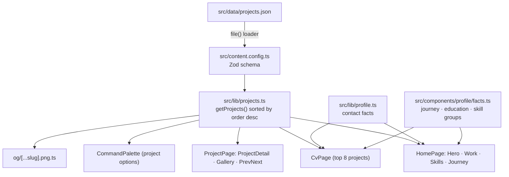

# Architecture

This document describes how the portfolio is built: rendering, routing, data, components, client scripts, styling,
motion, performance and SEO. Everything below reflects the code in `src/`. If the code and this document disagree,
the code is right and this document needs fixing.

---

## 1. Rendering model

- **Static site generation.** `astro build` pre-renders every route to HTML in `dist/`. There is no server runtime and
  no client-side framework.
- **Islands without frameworks.** Interactive behaviour comes from small TypeScript modules in `<script>` tags inside
  `.astro` components. Astro bundles these as ES modules into hashed files under `/_astro/` and includes them only on
  pages that use the component.
- **Progressive enhancement.** Markup is complete without JavaScript: every project row is a plain link, gallery
  thumbnails link to the full-size file, and the CV can be printed with `Ctrl/⌘ + P`. Scripts only toggle `[hidden]`,
  ARIA state and classes. They never re-render lists.
- **Idempotent init.** Each script guards itself with a `data-ready` (or similar) attribute so that running it twice
  has no effect.

`astro.config.mjs`:

| Option | Value | Why |
| :-- | :-- | :-- |
| `site` | `https://gubbitkeytoday.github.io` | Absolute URLs for canonical, OG and sitemap |
| `base` | `/Profile` | GitHub Pages project site path; also used in dev and preview |
| `trailingSlash` | `always` | One canonical form per URL |
| `i18n` | `th` default, `en`, `prefixDefaultLocale: false` | `/` = Thai, `/en/` = English |
| `integrations` | `@astrojs/sitemap` (`th-TH`, `en-US`) | Localized sitemap index |
| `prefetch` | `prefetchAll: false`, `defaultStrategy: 'hover'` | Opt-in only. No link currently sets `data-astro-prefetch` |
| `vite.plugins` | `@tailwindcss/vite` | Tailwind CSS v4 |

## 2. Routing and i18n

| Route (under `/Profile`) | File | View |
| :-- | :-- | :-- |
| `/` · `/en/` | `src/pages/index.astro` · `src/pages/en/index.astro` | `src/views/HomePage.astro` |
| `/projects/<id>/` · `/en/projects/<id>/` | `src/pages/projects/[slug].astro` · `src/pages/en/projects/[slug].astro` | `src/views/ProjectPage.astro` |
| `/cv/` · `/en/cv/` | `src/pages/cv.astro` · `src/pages/en/cv.astro` | `src/views/CvPage.astro` |
| `/404.html` | `src/pages/404.astro` | Bilingual, `noindex` (GitHub Pages serves it for any missing path) |
| `/og/<name>-<lang>.png` | `src/pages/og/[...slug].png.ts` | Build-time PNG endpoint |
| `/robots.txt` | `src/pages/robots.txt.ts` | Text endpoint |
| `/sitemap-index.xml` | `@astrojs/sitemap` | Generated |

Every page file is a thin wrapper that passes `lang` to a shared view, so the two locales cannot drift apart
structurally. Both project routes share `getStaticPaths` from `src/lib/project-paths.ts`, which also computes the
previous and next project.

A build produces 41 HTML pages: 2 home pages, 36 project pages (18 × 2), 2 CV pages and the 404 page.

`src/i18n/index.ts` provides:

- `LANGS`, `DEFAULT_LANG`, `HTML_LANG`, `OG_LOCALE`.
- `href(lang, path)`: a locale-aware internal URL that includes the base path (`href('en', '/projects/metro3d/')` →
  `/Profile/en/projects/metro3d/`). It also handles `#hash` paths.
- `asset(path)`: a URL for a file in `public/`.
- `stripLocale(pathname)`: the locale-agnostic path, used by the language switcher.
- `makeT(dict, lang)`: a typed translator over a co-located `{ th: {...}, en: {...} }` dictionary. A missing key
  falls back to Thai, then to the key itself.
- `ui` / `useUi(lang)`: strings shared by more than one component.
- `SECTIONS`: home-page section order, which is also the nav order (`work`, `skills`, `journey`, `about`, `contact`).

The language links keep the current `#hash` (`initLangLinks` in `src/scripts/nav.ts`), and so does the palette's
"switch language" command.

## 3. Data flow

- **`src/data/projects.json`** is the single source of truth for project content. The schema requires both locales
  for `title`, `role` and `summary`, a `cover` with real `width`/`height`, and a typed `gallery` (an image with an
  optional `format: "jpg"`, or a video).
- **`src/lib/profile.ts`** holds name, email, phone, location and social links.
- **`src/components/profile/facts.ts`** holds the journey timeline, education, working principles and CV skill groups.
  It also has `tidy()`, which removes the marketing phrases the UX review flagged ("enterprise-grade",
  "Windows Kernel") wherever they might still appear in text.
- **Counts are always derived.** The project count in the meta description, OG image, CV and hero comes from
  `getProjects().length`. Skill tile numbers come from `projectsUsing()` in `src/components/skills/tech.ts`, which uses
  the same `techKey()` as the Work filter, so a skill's number always equals the result of `/?tech=<tag>#work`.

## 4. Component map

### Layout

| Component | Purpose |
| :-- | :-- |
| `layouts/Base.astro` | `<head>`: title, description, canonical, hreflang, OG and Twitter tags, JSON-LD `Person`, manifest, and an inline theme bootstrap that runs before first paint. Also renders the skip link |
| `components/layout/Nav.astro` | Sticky header with section links, language switch, theme toggle, palette trigger, CV link, and a mobile drawer in a `<dialog>` |
| `components/layout/Footer.astro` | Footer links, live year, back-to-top button with a scroll-progress ring |
| `components/layout/CommandPalette.astro` | `<dialog>` command palette. Options (actions, sections, projects) are rendered at build time |

### Home sections (`components/sections/`)

| Component | Purpose |
| :-- | :-- |
| `Hero.astro` | Name, role, value proposition, calls to action, and the flagship project tile (BKK Transit) |
| `Work.astro` | "01 — Work": curated featured bento and a filterable index of every project |
| `Skills.astro` | "02 — Skills": domain tiles whose counts link to `?tech=` filters |
| `Journey.astro` | Timeline from `facts.ts` (education → projects → now), linking to case studies |
| `About.astro` | Bio, principles, stat counters (count-up only when motion is allowed) |
| `Contact.astro` | Contact channels with copy buttons, and a LINE QR in a native `popover` |

### Feature components

| Component | Purpose |
| :-- | :-- |
| `hero/FeaturedTile.astro` | Flagship cover (the page's LCP image, `fetchpriority="high"`) with two decorative lazy "peek" covers on wide screens |
| `hero/TechMarquee.astro` | CSS marquee of the core stack. The first track is the accessible list and the duplicate is `aria-hidden`. A pause button (`aria-pressed`) appears once JS runs, and the marquee is a static list under reduced motion |
| `work/FeaturedTile.astro` | Bento tile. The whole tile is one link (stretched `::after` on the title link) and carries a `view-transition-name` |
| `work/Filters.astro` | Category pills (`aria-pressed`), a labelled tech `<select>`, search input, active-filter chip. Hidden without JS |
| `work/ProjectRow.astro` | One row of the editorial index. A plain link whose `data-*` attributes are what the filter reads |
| `work/meta.ts` | Build-time helpers: category labels and icons, card metrics (audit scores excluded), icon tags |
| `work/shared.ts` | Shared between build and client: `norm()`, `techKey()`, `CATEGORIES` |
| `skills/SkillTile.astro` | One skill domain: brand icons, per-tool project counts, links to filtered work |
| `skills/tech.ts` | Skill domains, marquee list, `projectsUsing()` |
| `profile/SectionHead.astro` | Editorial section header ("03 — Journey" eyebrow, `h2`, optional lead) |
| `profile/facts.ts` | Biographical data shared by home and CV |
| `project/ProjectDetail.astro` | Case-study page body: hero cover (`view-transition-name`), summary, links, features, `BreadcrumbList` + `SoftwareSourceCode` JSON-LD |
| `project/ProjectFacts.astro` | Facts panel: role, year, category, tags (Latin tags get `lang="en"` on Thai pages) |
| `project/MetricGrid.astro` | Metric tiles with a visually hidden `h2` |
| `project/Gallery.astro` | Thumbnail grid of links (works without JS), enhanced by `gallery.ts` |
| `project/gallery.ts` · `lightbox.css` | PhotoSwipe 5 lightbox: native `<video>` slides, tall-capture zoom and pan, localized labels |
| `project/media.ts` | Build-time `srcset` variants (capped at intrinsic width) and poster sizes read from JPEG headers |
| `project/PrevNext.astro` | Previous/next project links (`rel="prev"`/`rel="next"`) |
| `project/SectionHead.astro` | "01 — Title" heading used inside the case study |
| `project/dict.ts` | Strings shared by the project components and the lightbox |
| `ui/Icon.astro` | Build-time Iconify SVG (`lucide:*`, `simple-icons:*`). The first use of an icon on a page emits a `<symbol>`, and later uses are a small `<use href>` (tracked in `Astro.locals.iconSprite`, typed in `src/env.d.ts`). Decorative by default (`aria-hidden`); `label` adds `role="img"` and an escaped `<title>`; `brand` tints with the official colour |

### Views

| View | Purpose |
| :-- | :-- |
| `views/HomePage.astro` | Nav, the six sections, Footer and CommandPalette |
| `views/ProjectPage.astro` | Nav, ProjectDetail, Footer and CommandPalette, with a per-project OG image and `og:type=article` |
| `views/CvPage.astro` | A4 résumé sheet with a toolbar (back, switch language, print). Print styles output black on white with URLs as text |

## 5. Client scripts

| Script | Loaded by | What it does |
| :-- | :-- | :-- |
| `scripts/nav.ts` | Nav | Glass header once the page has scrolled, and hides it on scroll down (rAF-throttled, passive listener). Scroll-spy via `IntersectionObserver` sets `aria-current` on section links. Opens the drawer with `showModal()`, traps focus, closes on backdrop click or link, returns focus to the opener, and closes when the viewport reaches desktop width. Language links keep the `#hash`. Shows `⌘` instead of `Ctrl` on Apple platforms |
| `scripts/theme.ts` | `nav.ts` | Theme toggle buttons: swaps the label or `aria-label` and updates `meta[name=theme-color]`. Follows OS changes until the visitor makes an explicit choice |
| `scripts/ui.ts` | shared | `toast()` (`role="status"`), `copyText()` with a textarea fallback, `prefersReducedMotion()`, `setTheme()` (persists to `localStorage`, dispatches `themechange`) |
| `scripts/palette.ts` | CommandPalette | Opens on `⌘K`/`Ctrl K`, on `/` (when the user is not typing) or from any `[data-cmdk-open]` element. Filters and ranks the build-time options, keeps DOM order equal to visual order, supports Arrow/Home/End/Enter keys, `aria-activedescendant`, a debounced result-count announcement, and focus return on close. Actions: copy email, open CV, toggle theme, switch language, open GitHub or LINE |
| `scripts/search.ts` | palette (build and client) | `normalize()` / `tokens()`: lower-cases, folds Latin accents (`ARÓM` → `arom`) and strips separators. Thai marks are kept |
| `scripts/footer.ts` | Footer | Sets the live year. The back-to-top button appears after the first viewport and hides while the footer is visible. Progress ring uses a CSS `scroll()` timeline, with a rAF fallback where unsupported |
| `components/work/work.ts` | Work | Category, tech and search filters with per-category counts, a status line, empty state, and URL sync (`?cat=`, `?tech=`, `?q=`; `?tag=` is accepted as an alias). Reads the initial state from the URL. Hides the bento while filtering and keeps the filter bar in place. Shows a floating cover preview on desktop hover, and sets a `view-transition-name` on click so the preview morphs into the project hero |
| `components/project/gallery.ts` | Gallery | PhotoSwipe lightbox. The core module is loaded with `import()` only when the lightbox first opens |
| inline in `About.astro` | About | Count-up for stat numbers. The final values are already in the HTML; it animates only off-screen counters and only when motion is allowed |
| inline in `Contact.astro` | Contact | Copy buttons. On hover-capable pointers, the LINE QR popover also opens on hover and focus |
| inline in `TechMarquee.astro` | TechMarquee | Reveals and wires the pause/play button |
| inline in `CvPage.astro` | CV | Reveals the print button and calls `window.print()` |
| inline in `Base.astro` | every page | Sets `data-theme` before first paint: stored choice, otherwise `prefers-color-scheme` |

## 6. Styling and tokens

- `src/styles/global.css` declares the layer order (`theme, base, components, utilities`), imports Tailwind and the
  Fontsource faces, and defines the tokens.
- **Runtime theme tokens** (`--bg`, `--fg`, `--accent`, …) are plain custom properties on `:root`/`[data-theme="dark"]`
  and `[data-theme="light"]`, written in OKLCH with hex noted for reference. `@theme inline` maps them to Tailwind
  utilities (`bg-bg-1`, `text-fg-2`, `border-line`, `shadow-elev-2`, …).
- **Static design tokens** live in `@theme`: font stacks, the fluid type scale (`--text-3xs` … `--text-hero`), tracking,
  radii, easings, three durations, container and spacing.
- **Theme variants:** `dark:` and `light:` custom variants key off `[data-theme]`, not the media query, so the visitor's choice wins.
- Component-specific CSS lives in scoped `<style>` blocks in each `.astro` file.

The full token tables and typography rules are in
[ACCESSIBILITY_AND_DESIGN_SYSTEM.md](./ACCESSIBILITY_AND_DESIGN_SYSTEM.md).

## 7. Motion

- **Page transitions:** native cross-document view transitions (`@view-transition { navigation: auto; }`) with no
  JavaScript router. Shared elements use `view-transition-name: project-<id>` (bento tile, hover preview and project
  hero), so a cover morphs into the case-study hero.
- **Scroll-driven reveals:** `animation-timeline: view()` in SkillTile, Journey, FeaturedTile, ProjectDetail and
  Gallery, wrapped in `@supports (animation-timeline: view())`. Browsers without support show content statically,
  never hidden. The footer progress ring uses `animation-timeline: scroll(root block)`.
- **Entry animations** for dialogs and popovers use `@starting-style` (Nav drawer, CommandPalette, Contact QR).
- **Reduced motion:** under `prefers-reduced-motion: reduce`, view transitions are disabled, animation and transition
  durations are reduced to 0.01 ms, smooth scrolling is turned off, the marquee becomes a static list, count-ups do
  not run, PhotoSwipe uses no zoom animation, and gallery videos do not auto-preview.

## 8. Performance decisions

- Static HTML, with no framework runtime. Each page ships only its own small modules; PhotoSwipe's core is loaded on
  demand.
- **LCP:** the hero flagship cover and the project hero image are `loading="eager"` with `fetchpriority="high"`.
  Other images are `loading="lazy"` with `decoding="async"`.
- **Responsive images:** every image has `srcset` built from the `<path>-<width>` variants and explicit
  `width`/`height` (enforced by a test), which prevents layout shift.
- **Fonts:** self-hosted variable fonts (no font CDN) with `font-display: swap`; `unicode-range` subsets mean browsers
  fetch only the scripts they need. No preloads — measured: they competed with the LCP image without improving LCP,
  and font-swap CLS stays ≈ 0.01.
- **CSS:** inlined per page (`build.inlineStylesheets: 'always'`, ~20 KB gzipped) so nothing blocks first render.
- **Rendering:** sections below the hero use `content-visibility: auto` (with remembered `contain-intrinsic-size`), which
  cut style/layout time by ~35 % on the Thai home page, where dictionary-based Thai line breaking is expensive.
- **LCP image:** covers ship a 720w variant (`scripts/make-cover-variants.mjs`) so phones don't fetch the 960w file.
- **Icons:** inlined SVG at build time, so there is no icon font, external sprite or runtime fetch. Each icon's path data appears once per page as a `<symbol>`, and repeats reference it with `<use>`.
- **Scroll work:** listeners are passive and rAF-throttled, observers replace scroll polling where possible, and CSS
  scroll timelines are preferred over JavaScript.
- **Budgets** are enforced by Lighthouse CI (see [DEPLOYMENT.md](./DEPLOYMENT.md#3-ci-pipeline)): JS transfer ≤ 50 KB,
  zero third-party requests, performance ≥ 0.85, CLS ≤ 0.05 (errors); LCP ≤ 2.5 s (warning).

## 9. SEO

| Concern | Implementation |
| :-- | :-- |
| Canonical | `Base.astro` emits an absolute `<link rel="canonical">` for each locale's own URL |
| hreflang | `th`, `en` and `x-default` (→ Thai) alternates on every indexable page |
| Open Graph / Twitter | `og:type`, `og:title`, `og:description`, `og:url`, `og:image` (1200 × 630), `og:locale` + `og:locale:alternate`, `twitter:card=summary_large_image` |
| OG images | `src/pages/og/[...slug].png.ts` renders `og/home-{th,en}.png` and `og/<id>-{th,en}.png` with satori (static Fontsource WOFF: Space Grotesk and Anuphan, with Thai word segmentation for line wrapping), then encodes them with sharp. The CV page uses the home image |
| JSON-LD | `Person` on every page. Project pages add `BreadcrumbList` and `SoftwareSourceCode` |
| Sitemap | `@astrojs/sitemap` with `th-TH`/`en-US` alternates. The 404 page is excluded |
| robots.txt | `src/pages/robots.txt.ts`: `Allow: /` plus an absolute `Sitemap:` line |
| Manifest | `public/manifest.webmanifest`, with `start_url` and `scope` set to `/Profile/` |
| 404 | `noindex`, links to both home pages |

All of the above is asserted by `tests/seo.spec.ts` and `tests/projects.spec.ts`.
