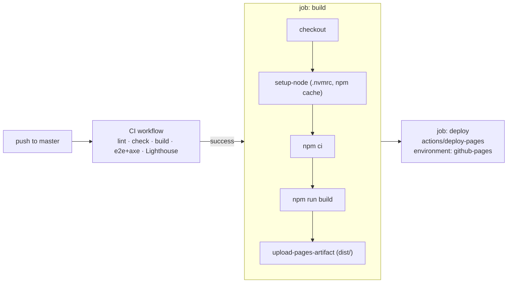

# Deployment and Operations

How the site is built, checked and published, plus the media pipeline and troubleshooting.

- **Production URL:** <https://gubbitkeytoday.github.io/Profile/>
- **Host:** GitHub Pages (project site, base path `/Profile/`)
- **Branch:** `master`
- **Workflows:** `.github/workflows/ci.yml` (checks) and `.github/workflows/deploy.yml` (publish)

---

## 1. One-time GitHub Pages setup

In the repository, go to **Settings → Pages → Build and deployment → Source** and choose **GitHub Actions**.

This is required. With "Deploy from a branch" selected, the `actions/deploy-pages` step fails and Pages keeps serving
the legacy branch build.

## 2. Deploy flow (`deploy.yml`)

Triggers: the **CI** workflow completing successfully for a push to `master` (`workflow_run`), or a manual run
(`workflow_dispatch`). The build checks out exactly the commit CI verified (`workflow_run.head_sha`).



- Permissions: `contents: read`, `pages: write`, `id-token: write`.
- Concurrency group `pages` with `cancel-in-progress: false`, so a running production deploy always finishes.
- `ASTRO_TELEMETRY_DISABLED=1`.

A failed or cancelled CI run never deploys. Branch protection with the "CI" checks marked as required additionally
keeps red pull requests from being merged into `master` in the first place.

## 3. CI pipeline

`ci.yml` runs on every pull request, on pushes to `master`, and manually. Older runs on the same ref are cancelled.

### Job `verify`: Lint · typecheck · build · e2e (timeout 25 min)

| Step | Command |
| :-- | :-- |
| Install | `npm ci` (Node from `.nvmrc` = 22) |
| Lint | `npm run lint` → `biome check .` |
| Type-check | `npm run check` → `astro check` |
| Build | `npm run build` |
| Browser | `npx playwright install --with-deps chromium` |
| E2E | `npm run test:e2e` with `PW_SKIP_BUILD=1` (serves the `dist/` that was just built through `astro preview`) |
| On failure | Uploads `playwright-report/` and `test-results/` (14 days) |
| Always | Uploads `dist/` as an artifact for the Lighthouse job (3 days) |

Playwright runs two projects, `chromium-desktop` (1440 × 900) and `chromium-mobile` (Pixel 7), with one retry and two
workers in CI. The suites are:

| Spec | Checks |
| :-- | :-- |
| `tests/a11y.spec.ts` | axe-core with tags `wcag2a`, `wcag2aa`, `wcag21aa`, `wcag22aa` must report **zero** violations on: home TH and EN × dark and light, and the first project page (TH) × dark and light. Runs with `reducedMotion: 'reduce'` after scrolling the page. Also checks that the skip link is the first tab stop and focuses `#main` |
| `tests/health.spec.ts` | No console errors, page errors, failed requests or HTTP ≥ 400 (home TH/EN, one project). Every `` has numeric `width`/`height` and `alt`. Every internal link on both home pages returns 200 |
| `tests/seo.spec.ts` | `lang`, single `h1`, title, description, canonical, hreflang (`th`/`en`/`x-default`), `og:url`, `og:image` is a 1200 × 630 PNG, JSON-LD parses and includes `Person`. Also checks the sitemap index and children, robots.txt, the manifest scope and icons, and that the 404 page returns 404 with `noindex` |
| `tests/projects.spec.ts` | Every project in `projects.json` × both locales: 200, `lang`, one `h1` containing the title, canonical, and the `og:image` URL resolves to a PNG |

### Job `lighthouse`: Lighthouse CI (needs `verify`, timeout 20 min)

Downloads `dist/`, runs `npm ci` (because `astro preview` serves the `/Profile/` base), then `npm run lhci`. Reports go
to `.lighthouseci/` and are uploaded as an artifact (14 days).

Configuration (`lighthouserc.cjs`): URLs `/Profile/`, `/Profile/en/` and `/Profile/projects/metro3d/`, 3 runs each, default
mobile emulation with simulated throttling. Pages are served by LHCI's own static server (gzip, like GitHub Pages) from a
`.lhci-root/Profile → dist` symlink, so byte-based metrics match production.

| Assertion | Level | Threshold |
| :-- | :-- | :-- |
| `categories:performance` | error | ≥ 0.85 (median run) — regression floor; v2 measures 0.89–0.99, v1 was 0.78 |
| `categories:accessibility` | error | = 1.00 |
| `categories:best-practices` | error | ≥ 0.95 |
| `categories:seo` | error | = 1.00 |
| `largest-contentful-paint` | warn | ≤ 2500 ms (median) — target; currently ~1.8–3.1 s in simulated slow 4G |
| `cumulative-layout-shift` | error | ≤ 0.05 (median) |
| `resource-summary:script:size` | error | ≤ 51200 bytes (50 KB transfer) |
| `resource-summary:third-party:count` | error | 0 |
| `total-blocking-time` | warn | ≤ 200 ms (median) |
| `total-byte-weight` | warn | ≤ 1,600,000 bytes |

## 4. Verify locally

```bash
nvm use            # Node 22
npm ci
npm run test:install   # first time only: Chromium for Playwright
npm run verify         # lint → check → build → test
```

`npm test` builds first by default. To reuse an existing `dist/`, set `PW_SKIP_BUILD=1`. Other environment knobs in
`playwright.config.ts`:

- `PW_PORT`: the preview port (default `4321`).
- `PLAYWRIGHT_CHROMIUM_PATH`: a custom Chromium binary.

Lighthouse locally:

```bash
npm run build
npm run lhci
# without Google Chrome installed, point it at a Chromium binary:
CHROME_PATH=/path/to/chromium npm run lhci
```

## 5. Media optimization

Media lives in `public/media/<folder>/` and is copied unchanged to `dist/media/`. Astro does not process it, so
variants must be generated before committing.

### Naming

```text
<path>-<width>.webp     responsive WebP variant (480, 960, 1600 are the usual widths)
<path>-<width>.jpg      JPEG variant of the same width
<path>.mp4              gallery video (H.264)
<path>-poster.jpg       video poster
```

`path` in `src/data/projects.json` omits the width and extension. `widths` lists the files that exist. When a source
is narrower than a bucket, the variant is exported without upscaling, and `src/components/project/media.ts` caps the
`srcset` descriptor at the real width.

### Generate variants with sharp (already a dev dependency)

```bash
node --input-type=module -e '
import sharp from "sharp";
const [src, out] = process.argv.slice(1);          // e.g. shot.png media/foo/01-home
for (const w of [480, 960, 1600]) {
  const img = sharp(src).resize({ width: w, withoutEnlargement: true });
  await img.clone().webp({ quality: 82 }).toFile(`public/${out}-${w}.webp`);
  await img.clone().jpeg({ quality: 80, mozjpeg: true, progressive: true }).toFile(`public/${out}-${w}.jpg`);
}' shot.png media/foo/01-home
```

### Or with cwebp

```bash
cwebp -q 82 -resize 1600 0 shot.png -o public/media/foo/01-home-1600.webp
cwebp -q 82 -resize 960  0 shot.png -o public/media/foo/01-home-960.webp
cwebp -q 82 -resize 480  0 shot.png -o public/media/foo/01-home-480.webp
```

### Video and poster

```bash
ffmpeg -i demo.mov -c:v libx264 -crf 24 -preset slow -pix_fmt yuv420p -movflags +faststart -an public/media/foo/demo.mp4
ffmpeg -i public/media/foo/demo.mp4 -frames:v 1 -q:v 3 public/media/foo/demo-poster.jpg
```

### WebP size limit

WebP cannot encode an image with a dimension above **16383 px**. Full-page captures taller than that cannot have WebP
variants. Export JPEG only, and mark the gallery item. This is the real entry in the data:

```json
{
  "type": "image",
  "path": "media/arom-coffee/00-responsive-previews-mobile-index-full",
  "widths": [480, 780],
  "format": "jpg",
  "width": 780,
  "height": 26702
}
```

Covers are always read as WebP (both by the site and by the OG generator), so a cover must have WebP variants.

### Sync dimensions

```bash
npm run media:dims
```

`scripts/sync-media-dimensions.mjs` reads the largest variant of every cover and gallery image with sharp and writes
`width`/`height` back into `projects.json`. It exits non-zero and lists any missing file. Run it after adding or
replacing screenshots, then run `npm run lint` (Biome formats the JSON).

### Repository size

`public/media/` holds about 1,450 files (about 90 MB). To speed up clones, consider moving
original sources out of git (Releases or object storage) and rewriting history with `git filter-repo`. That is a
manual, destructive step.

## 6. Caching

- **`/_astro/*`** (JS, CSS, fonts) have content hashes in their filenames. A new build produces new names, so you never
  need cache-busting query strings.
- **HTML, `media/*`, `og/*.png`, `robots.txt`, `sitemap-*.xml`** keep stable URLs. GitHub Pages serves them with a
  short `Cache-Control: max-age` (about 10 minutes), so updates appear after that window or after a hard reload.
- **Replacing an image in place** keeps its URL, so browsers and social-card caches may show the old version for a
  while. To force a refresh, use a new filename.
- Social platforms cache OG images separately. Use their debuggers (for example the Facebook Sharing Debugger) to
  re-scrape.

## 7. Troubleshooting

| Symptom | Cause and fix |
| :-- | :-- |
| Deploy job fails at "Deploy to GitHub Pages" | Pages source is not **GitHub Actions** (see §1), or the `github-pages` environment has protection rules that block `master` |
| Live site still shows the old vanilla site | Same as above: the branch build is still active |
| Assets 404 on the live site, fine locally | A hard-coded absolute path such as `/media/...`. Use `asset()` / `href()` from `@/i18n`, which add the `/Profile` base |
| `astro build` fails with a Zod error | `projects.json` is missing a required field or locale (both `th` and `en` are required) or a URL is invalid. The error names the entry and field |
| `npm run media:dims` exits 1 | A variant listed in `widths` is missing, or a gallery item needs `"format": "jpg"` |
| `health.spec` reports `HTTP 404: …-960.webp` | Missing variant file. Generate it or fix `widths` |
| `health.spec` reports `img` without width/height | A new `` was added without explicit dimensions. Pass the intrinsic size from the data |
| `a11y.spec` color-contrast violation in one theme | A hard-coded colour. Use tokens (`text-fg-3`, `var(--accent)`, …) that are defined for both themes |
| OG build fails or renders tofu | satori needs static WOFF fonts. Keep `@fontsource/space-grotesk` and `@fontsource/anuphan` installed (dev dependencies) |
| Lighthouse `script:size` fails | A new client dependency landed in the initial bundle. Lazy-load it with `import()` as `gallery.ts` does for PhotoSwipe |
| Lighthouse `third-party:count` fails | Something loads from another origin (CDN font, analytics, embed). Self-host it or remove it |
| Playwright cannot find a browser | Run `npm run test:install`, or set `PLAYWRIGHT_CHROMIUM_PATH` |
| `astro preview` port already in use during tests | Set `PW_PORT` to a free port. Locally, an existing server on that port is reused |
